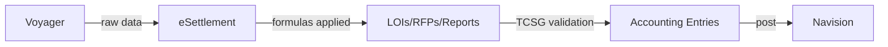

# Backend Formulas in Esettlement System

## Who Asks

| | |
|---|---|
| **Requested by** | Accounting Department or External Auditors |
| **How they ask** | Email, Sapphire Ticket, In-person |
| **Frequency** | Ad-hoc |

## What It Is

eSettlement sources data from Voyager and applies backend formulas to produce settlement LOIs and RFPs. Once TCSG manually validates the output, the data undergoes further processing into accounting entries, which Accounting then posts into Navision.

## When This Request Happens

- Accounting requests this during verification to confirm that bridge entries align with eSettlement's processed data.
- Auditors request this to validate the same alignment between bridge entries and processed data.

## Prerequisites

- Familiarity with the integration between Voyager, eSettlement, and Navision, including their underlying backend processes.

## High-level diagram of the systems



## Gross Commission, Share in FX, Output VAT backend formula from `[dbo].[spProcessTxnPH943]`

### List of columns from ***Voyager Daily Report***

> ***The list below are the columns used in the backend formula of Esettlement.***

- Direction
- ClearChargesLOC
- ClearFXLOC
- ClearPrincipalLOC
- RecPrincipalLOC
- TotalChargesLOC

Let:

- **VAT Rate** = 0.12

- ***Direction*** = `I` → **WU Commission Rate** = 0.18

- ***Direction*** = `P`, `R`, `O`, `Q` → **WU Commission Rate** = 0.22

- ***Direction*** = `S` → **WU Commission Rate N** = 0.50

### For transactions where `Direction = I`

```
Gross Commission = ClearChargesLOC  
Share in FX = ClearFXLOC 
Output VAT = 0  
```
### For transactions where `Direction = P`

```
Gross Commission = ClearChargesLOC / (1 + VAT Rate)
Share in FX = ClearFXLOC / (1 + VAT Rate)
Output VAT = 1 * (Gross Commission + Share in FX) * (VAT Rate)
```
### For transactions where `Direction = O`

**1. `IF ProductCode = CAZS`**

```
Gross Commission = ClearChargesLOC / (1 + VAT Rate)
Share in FX      = (ClearPrincipalLOC - RecPrincipalLOC + ClearFXLOC) / (1 + VAT Rate)
Output VAT       = 1 * (Gross Commission + Share in FX) * VAT Rate
```

**2. `ELSE`**

- **`IF ClearFXLOC > 0`**

```
Gross Commission = -1 * ( (ClearChargesLOC / (1 - WU Commission Rate)) * WU Commission Rate / (1 + VAT Rate) )
Share in FX     = -1 * ( (RecPrincipalLOC + TotalChargesLOC - (ClearPrincipalLOC + ClearChargesLOC + ClearFXLOC)) - (ClearChargesLOC / (1 - WU Commission Rate) * WU Commission Rate) ) / (1 + VAT Rate)
```

- **`ELSE`**

```
Gross Commission = -1 * ( (RecPrincipalLOC + TotalChargesLOC - (ClearPrincipalLOC + ClearChargesLOC + ClearFXLOC) ) ) / (1 + VAT Rate)
Share in FX = 0
```

- **Outside of `IF ELSE`**

```
Output VAT = 1 * (Gross Commission * VAT Rate)
```

### For transactions where `Direction = Q`

**1. `IF CLearFXLOC > 0`**

```

```

**2. `ELSE`**

```

```