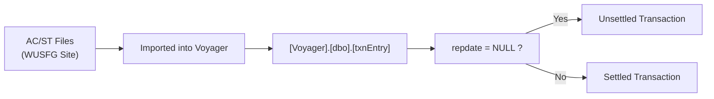
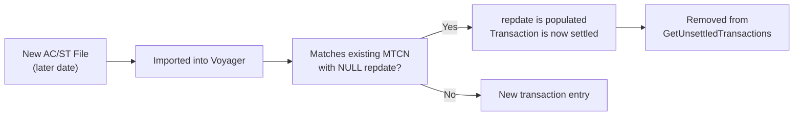

# Checking of Unsettled Transactions

Unsettled transactions refer to WU (Western Union) transactions that have not yet been settled by Western Union. From the backend's perspective, these are transactions where the `repdate` column has a value of `NULL`.

---

## Origin

1. **AC/ST Files** — Daily AC/ST files are downloaded from the WUSFG site and imported into the Voyager desktop application.
2. **Voyager Database** — The imported data populates `[Voyager].[dbo].[txnEntry]`. This table serves as eSettlement's raw data source.
3. **eSettlement Retrieval** — The *Retrieve Voyager Data* module in eSettlement fetches this data into `[BridgeDb].[dbo].[txnEntry]`.

If a transaction (identified by its MTCN) has a `NULL` value in the `repdate` column of `[Voyager].[dbo].[txnEntry]`, it means that specific transaction has **not yet been settled by Western Union**. The AC/ST files already reflect this state — Voyager simply stores whatever the files contain.



---

## Stored Procedure

The list of unsettled transactions is sent via email by the following stored procedure:

| Database | Stored Procedure |
|---|---|
| `Voyager` | `[dbo].[GetUnsettledTransactions]` |

This procedure queries `[Voyager].[dbo].[txnEntry]` for transactions where `repdate IS NULL` and emails the results to the relevant recipients.

---

## Nature of Unsettled Transactions

The transactions that typically end up unsettled are **WU Refund transactions**. These are refunds processed through Western Union that, for various reasons, do not get marked as settled in the system (i.e., their `repdate` remains `NULL`).

### Resolution on a Later Date

Unsettled transactions are **not necessarily permanent**. The `repdate` column can be populated on a later date when a subsequent AC/ST file contains data for that same transaction.

For example:
1. TCSG processes an AC/ST file for a new date.
2. That AC/ST file happens to include data for a previously unsettled transaction.
3. When imported into Voyager, the existing record's `repdate` column gets populated.
4. The transaction is now considered settled and automatically drops off from the results of `[dbo].[GetUnsettledTransactions]`.



### Limitations

Our tracing and understanding of this behavior is limited due to the fact that **Voyager is an application developed by Western Union**. It has been out of support long before the author joined the company. As such, the inner workings of how AC/ST file imports update existing records are not fully documented.

> **Note:** The above explanation is based on current understanding of the system and may not be entirely accurate. Further discovery may reveal a more precise mechanism.

---

## How to Check

To manually query unsettled transactions:

```sql
SELECT *
FROM [Voyager].[dbo].[txnEntry]
WHERE repdate IS NULL;
```

---

*Last updated: June 2026*
