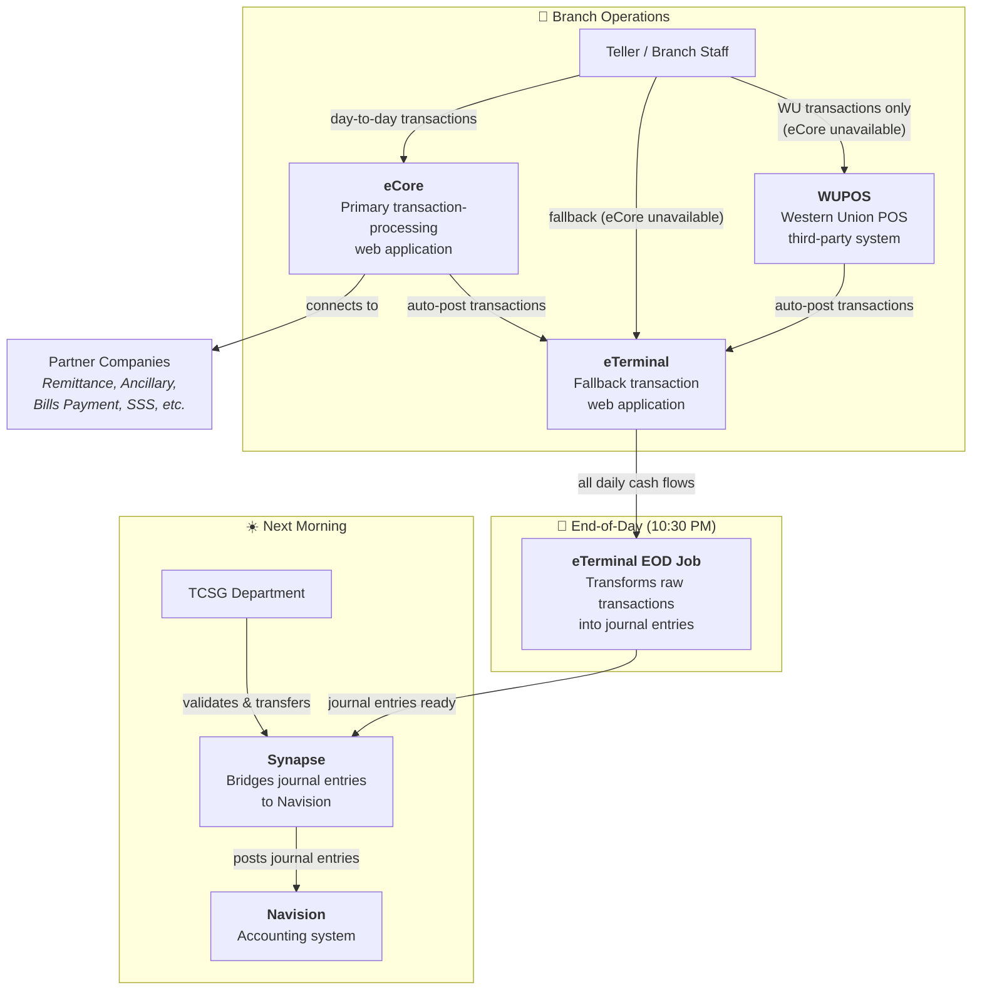
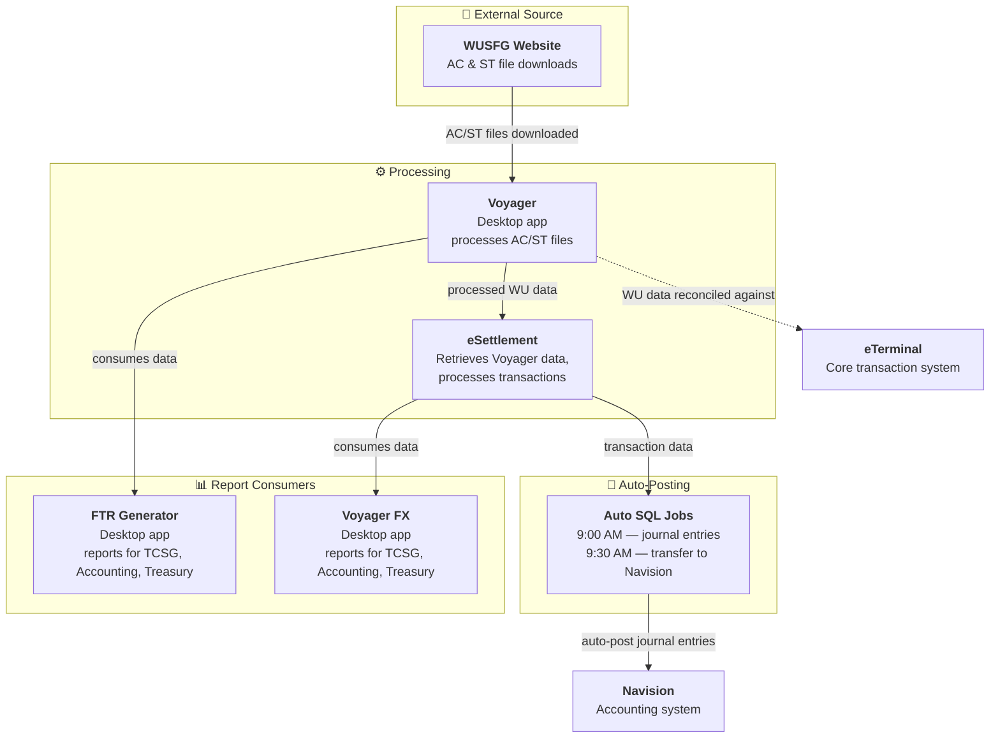

# System Architecture Overview

> **Disclaimer:** This diagram reflects my understanding of the system connections as of July 2026. It is not the authoritative truth — verify before relying on it.

---

## Core Transaction Flow

How branch transactions move from teller operations through end-of-day processing and into the accounting system.

> eCore is the primary system. eTerminal is the fallback. All cash flows — whether transacted through eCore, eTerminal, or WUPOS — eventually land in eTerminal for branch cash reporting and teller accountability. At 10:30 PM, the EOD background process transforms raw transactions into journal entries. The next morning, TCSG uses Synapse to validate and transfer those entries into Navision.

---

## Western Union Data Pipeline

How Western Union transaction files flow from download through processing, auto-posting, and reporting.

> TCSG downloads AC/ST files from WUSFG, processes them in Voyager, then feeds them into eSettlement. Automated SQL jobs handle the rest — creating journal entries at 9:00 AM and transferring to Navision at 9:30 AM (the automated equivalent of what Synapse does manually for eTerminal data). Voyager's WU data is also reconciled against eTerminal's internal WU records to ensure consistency.
>
> FTR Generator and Voyager FX are reporting tools that consume data from Voyager and eSettlement respectively, generating reports for TCSG, Accounting, and Treasury.

---

*Last updated: July 2026*
