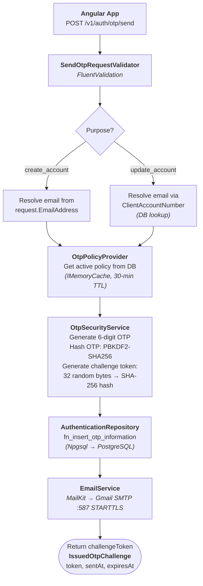
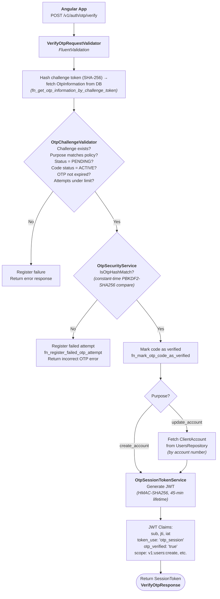
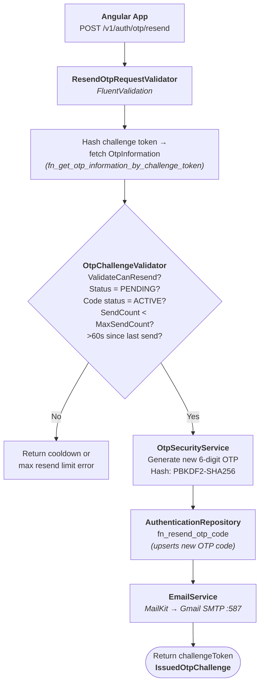
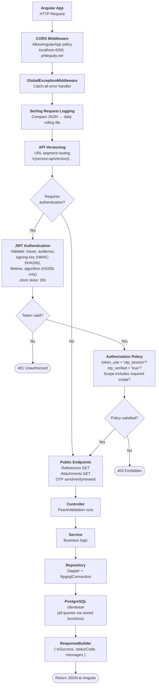
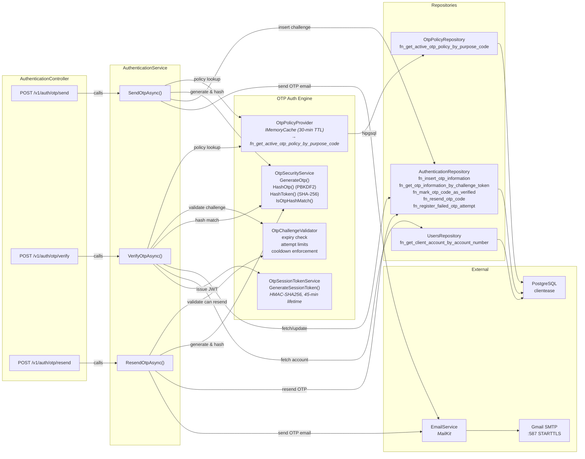
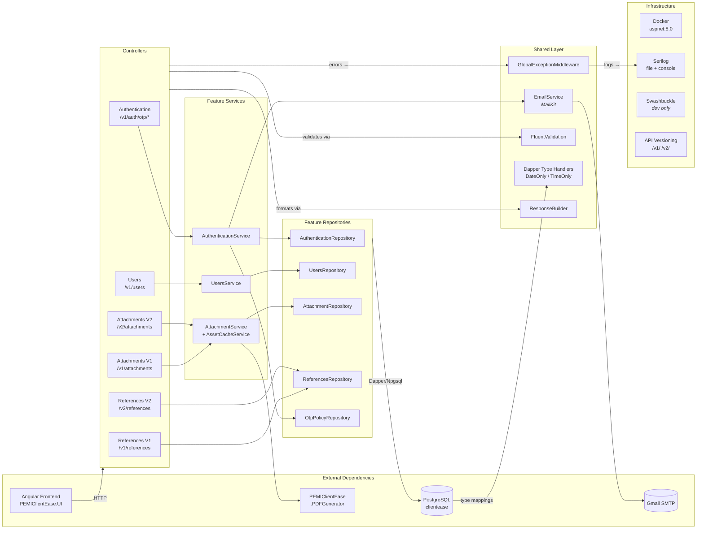

# ClientEase Core API

## What It Is

The backend REST API for PEMI ClientEase — Philequity Management, Inc.'s investor/account management portal. It handles OTP-based email authentication, investor profile creation, file attachments, and reference data lookups. It is consumed by an Angular frontend (PEMIClientEase.UI) and used daily by investors and PEMI operations staff.

## Where It Lives

| What | Where |
|---|---|
| **Source repo** | [GitHub](https://github.com/PEMIClientEase/PEMIClientEase.CoreAPI) |
| **Production URL** | [www.philequity.net/portal/](https://www.philequity.net/portal/) |
| **Staging URL** | [http://192.168.1.112/](http://192.168.1.112/) |
| **Server** | Ask IT Administrators |
| **Database** | `clientease` |

## Tech Stack

| Layer | Technology |
|---|---|
| **Language** | C# 12 |
| **Framework** | .NET 8 (ASP.NET Core Web API) |
| **Database** | PostgreSQL (via Npgsql 9.0 + Dapper 2.1) |
| **Hosting** | Docker (Linux container, `mcr.microsoft.com/dotnet/aspnet:8.0`) |
| **Auth** | JWT Bearer tokens (HMAC-SHA256), issued after OTP email verification |
| **Logging** | Serilog — compact JSON to file (daily rolling), console in non-Production |
| **Email** | MailKit 4.16 via Gmail SMTP (port 587, STARTTLS) |
| **Validation** | FluentValidation 12.1 |
| **API Docs** | Swashbuckle (Swagger), API versioning via URL segments (`/v1/`, `/v2/`) |
| **PDF Generation** | Sibling project `PEMIClientEase.PDFGenerator` (referenced as project dependency) |

## Access

| What | How to Get It |
|---|---|
| **Server access** | Ask IT Administrators |
| **Database access** | Ask IT Administrators |
| **Admin panel** | No admin panel; API accessed via Swagger UI at `/swagger` in Development |

> ⚠️ **Never store passwords or connection strings here.** Just say who to contact.

## Deployment

- **Method:** Docker Compose (`docker compose -f docker-compose-uat.yml up --build`); also manual publish via `publish.sh` (bash script: `dotnet publish -c Release -o ./publish`)
- **Pipeline:** [Link to CI/CD — to be filled]
- **Frequency:** [On every merge to main / weekly / on request — to be filled]
- **Who deploys:** [ICTG / DevOps / self-service — to be filled]

## Dependencies

| System / Service | How It Depends | What Breaks If It's Down |
|---|---|---|
| **PostgreSQL (ClientEaseDb)** | All data reads/writes via Dapper (users, OTP challenges, references, attachments, system errors) | Entire API non-functional |
| **Gmail SMTP** | Sends OTP codes to investors' registered email addresses | OTP send/resend endpoints fail; investors can't authenticate |
| **PEMIClientEase.PDFGenerator** | Project reference — used for generating PDF documents (reports/statements) | PDF generation endpoints fail |
| **Angular Frontend (PEMIClientEase.UI)** | Consumes this API; CORS configured for `localhost:4200` and `https://philequity.net/portal/` | Frontend can't function without the API |

## Handover Notes

### Architecture

- **Vertical slice** organization under `Features/` — each feature has its own `Api/`, `Application/`, `Contracts/`, `Domain/`, and `Infrastructure/` folders.
- **Cross-cutting concerns** live in `Shared/` (configuration, error handling, persistence type handlers, email service, web response helpers).
- **API versioning** uses URL segment strategy (`/v{version:apiVersion}/...`). Current active versions: v1 (authentication, users, references, attachments) and v2 (attachments, references).
- **Dapper** is used as the micro-ORM (no Entity Framework). Custom type handlers registered for `DateOnly` and `TimeOnly`.

### OTP Authentication Flow

- Three endpoints under `POST /v1/auth/otp/{send,verify,resend}`.
- OTP challenges are policy-driven: `OtpPolicy` table defines max send count, max resend attempts, max failed attempts, OTP validity period, and cooling-off period per purpose.
- After successful OTP verification, a JWT session token is issued (configurable lifetime, default 45 minutes).
- JWT validation is strict: issuer, audience, signing key, lifetime, and algorithm (HS256 only) are all enforced. Clock skew is 30 seconds.
- OTP policies and challenges are stored in PostgreSQL and managed by `OtpPolicyProvider` and `OtpChallengeValidator`.

### Configuration

- Environment-specific overrides: `appsettings.Development.json`, environment variables (double-underscore separator for nested keys, e.g., `ConnectionStrings__ClientEaseDb`).
- Docker `.env` file expected when running via `docker-compose`.
- Required config sections: `ConnectionStrings`, `FilePath`, `Assets`, `Smtp`, `OtpSessionToken`, `Cors`.
- Signing key must be at least 32 bytes (validated at startup).

### Known Gaps / TODOs

- End-to-end tests
- Clean up of the N+1 queries on the Repository layers of some features
- Globalized error handling implementation on all features
- `appsettings.json` currently contains a plaintext SMTP password and DB credentials — these should be moved to environment variables/secrets for production.

## Process Flow Diagrams

### 1. OTP Authentication Flow

#### 1a. Send OTP

#### 1b. Verify OTP

#### 1c. Resend OTP

### 2. Architecture & Component Hierarchy

#### 2a. Request Processing Pipeline

#### 2b. OTP Authentication Subsystem

#### 2c. Feature Map & Dependencies

---

*Last updated: July 2026*

