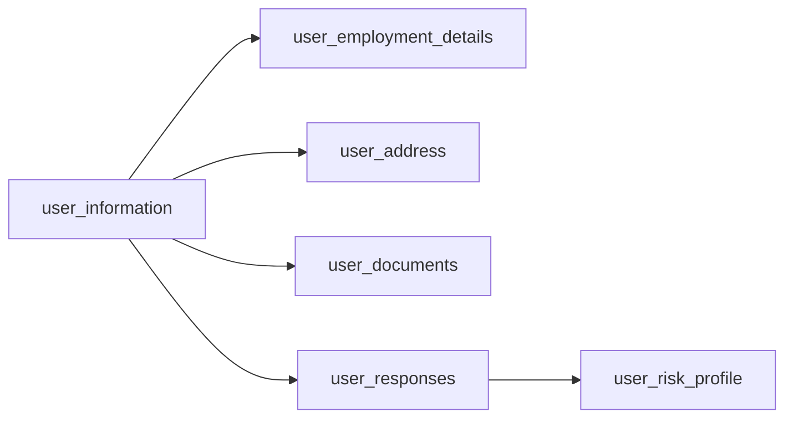
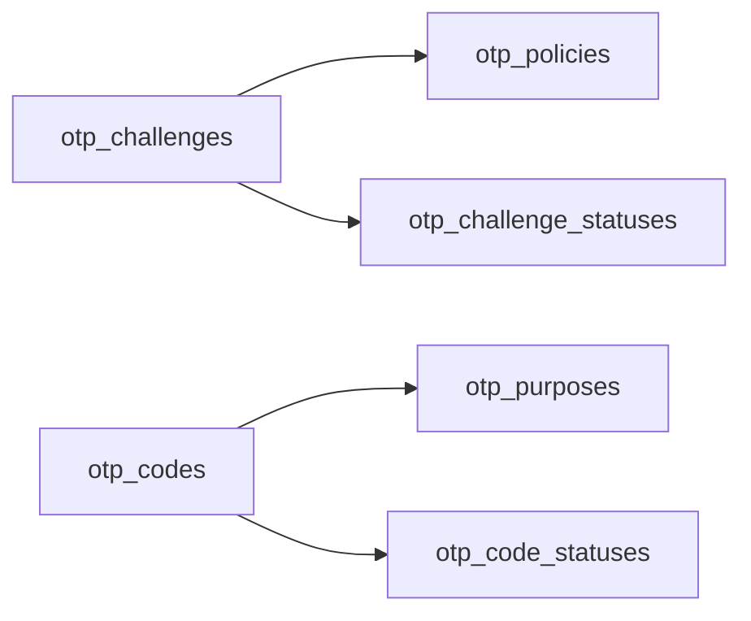

# Clientease Database

## Overview

Clientease uses PostgreSQL as its relational database management system. The backend API communicates with the database exclusively through PostgreSQL functions — no inline SQL queries. Dapper is used as the ORM for minimal C#-to-database interactions, while all data logic is authored in SQL functions. Tables are highly normalized with foreign key relationships.

The application is still in its early stages, so this page documents the current schema and structure as it stands.

---

## Database Summary

| Database | Purpose |
|---|---|
| `clientease` | Core database housing all investor, OTP, account, and config data |

---

## Key Tables

### User & Profile

| Table | What It Stores | Used In |
|---|---|---|
| `user_information` | Core investor identity — name, contact details, and login credentials | Registration, Profile |
| `user_employment_details` | Employment information linked to the investor | KYC / Onboarding |
| `user_address` | Address records (may be multiple per user) | KYC / Onboarding |
| `user_bank_account_details` | Bank account information for disbursements | Payouts / Redemptions |
| `user_documents` | Uploaded IDs, proof of address, and other verification files | Document verification |
| `user_responses` | Answers to KYC and suitability questions | Risk assessment |
| `user_risk_profile` | Computed risk classification | Suitability checks |
| `pep_related_perons` | Politically Exposed Person declarations | AML / Compliance |

### OTP Verification

| Table | What It Stores | Used In |
|---|---|---|
| `otp_challenges` | OTP challenge instances | Login, Transaction |
| `otp_codes` | Generated OTP codes | Login, Transaction |
| `otp_challenge_statuses` | Enum / reference for challenge states | Reference |
| `otp_code_statuses` | Enum / reference for code states | Reference |
| `otp_policies` | OTP configuration — expiry, resend limits, and other settings | System config |
| `otp_purposes` | Enum / reference for OTP intent types | Reference |

### Accounts

| Table | What It Stores | Used In |
|---|---|---|
| `client_accounts` | Basic account information — sourced from the Ideal Wealth & Funds system | Account management |
| `applicants` | Individual investor details tied to a single `client_accounts` record (one-to-many) | Onboarding |
| `accounts` | Individual investment accounts — managed internally within Clientease | Portfolio |
| `account_members` | Links users to accounts (one-to-many from `accounts`) | Account membership |

### Configuration / Reference

| Table | What It Stores |
|---|---|
| `banks` | Bank reference data |
| `cities` | City reference data |
| `countries` | Country reference data |
| `country_codes` | Country code mappings |
| `questions` | KYC / suitability questions |
| `answers` | Available answer options |
| `regions` | Region reference data |
| `states` | State reference data |
| `provinces` | Province reference data |
| `cities_and_municipalities` | Granular Philippines location data |
| `system_references` | General-purpose lookup and enum values |

### Video Verification

| Table | What It Stores | Used In |
|---|---|---|
| `schedules` | Video verification appointments | Video KYC |

---

## Table Relationships

### Onboarding Data Flow

### Accounts (External — Ideal Wealth & Funds)

`client_accounts` holds the basic account information. Each account has one or more `applicants` carrying the individual investor's personal details. This data originates from the Ideal Wealth & Funds system.

### Accounts (Internal — Clientease)

Same one-to-many structure, but stored and managed entirely within the Clientease database.

### OTP Verification

---

*Last updated: June 2026*
