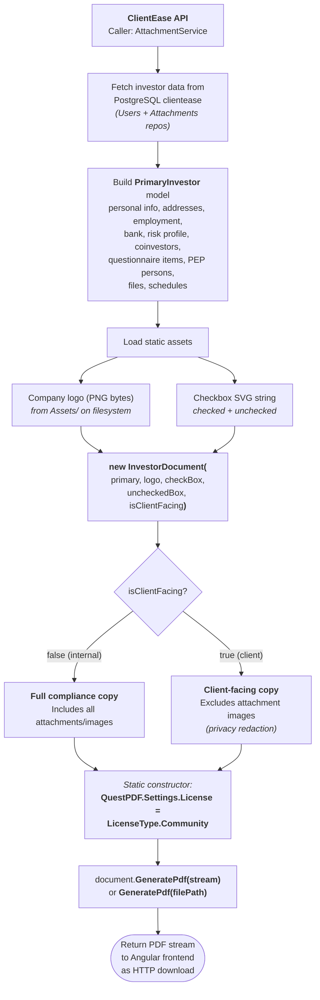
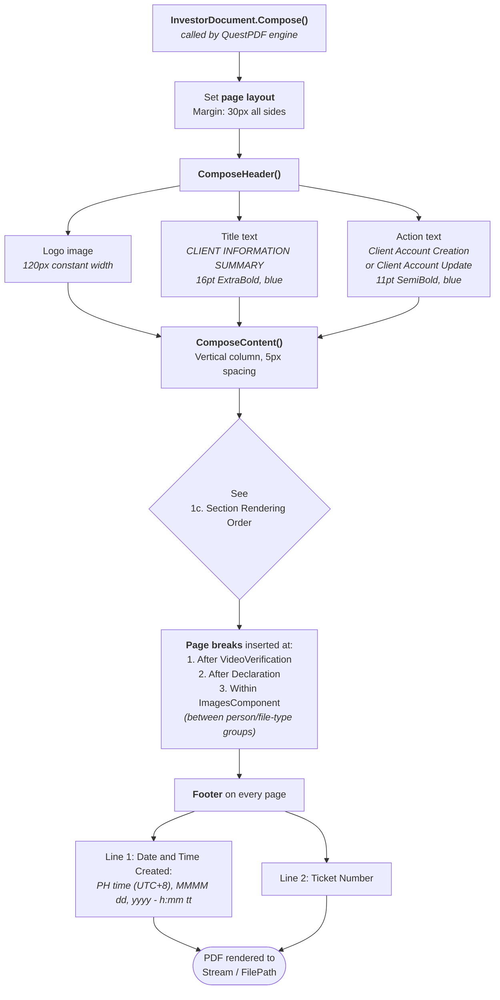
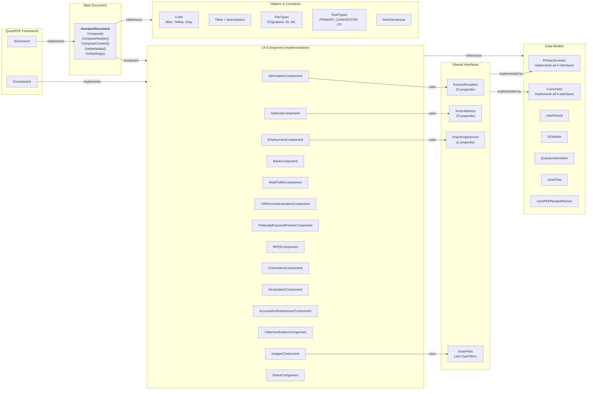
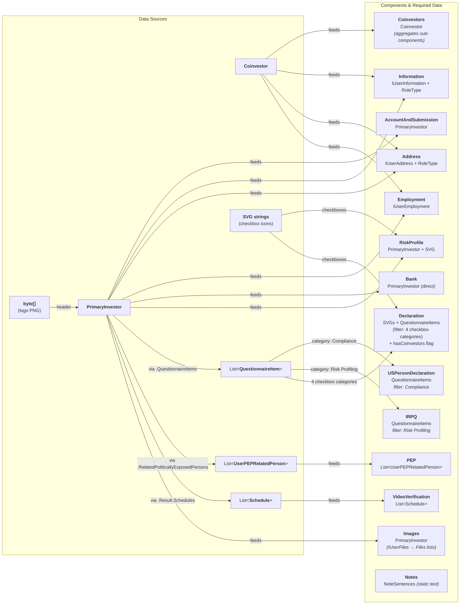
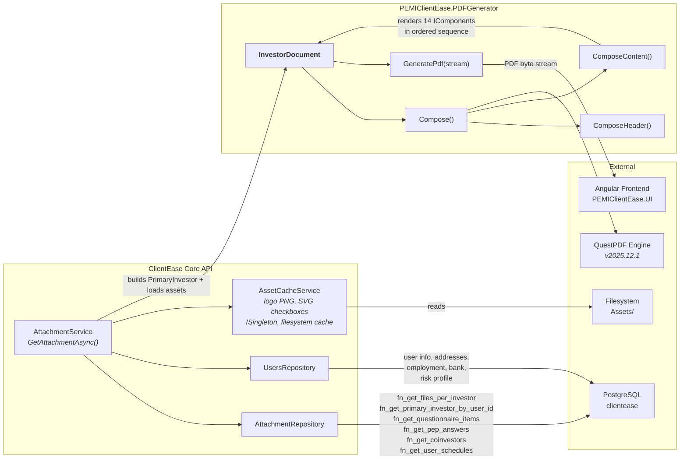

# PEMIClientEase.PDFGenerator

## What It Is

A class library that generates **Client Information Summary PDFs** for Philequity (PEMI) investor onboarding and account management workflows. It is consumed by a parent ASP.NET web API — the API collects investor data and feeds it to `InvestorDocument`, which composes a multi-section PDF covering personal details, addresses, employment, FATCA/PEP compliance, risk profile, bank details, coinvestors, declarations, video verification schedules, and uploaded attachments. The same document can be rendered as an **internal compliance copy** (with attachments) or a **client-facing copy** (without attachments).

## Where It Lives

| What | Where |
|---|---|
| **Source repo** | [GitHub](https://github.com/PEMIClientEase/PEMIClientEase.PDFGenerator) |

## Tech Stack

| Layer | Technology |
|---|---|
| **Language** | C# 12 |
| **Framework** | .NET 8.0 (LTS) |
| **PDF Library** | QuestPDF 2025.12.1 (Community License) |
| **Project Type** | Class Library (`Microsoft.NET.Sdk`) |

> ⚠️ **Never store passwords or connection strings here.** Just say who to contact.

## Dependencies

| System / Service | How It Depends | What Breaks If It's Down |
|---|---|---|
| **[Parent ASP.NET Web API](backend.md)**  | Provides the investor data models (`PrimaryInvestor`, `Coinvestor`, etc.) | PDF cannot be downloaded by the investor / user |
| **QuestPDF NuGet** | Core PDF rendering engine | Everything fails — no PDF output |
| **ClientEase Report Generator** | Provides the list version of data models, intended for Sales team | PDFs of the investors will not be generated |

## Process Flow Diagrams

### 1. PDF Generation Flow

#### 1a. Data Input & Setup

#### 1b. Document Composition Pipeline

#### 1c. Section Rendering Order

```mermaid
flowchart TD
    A["<b>ComposeContent()</b> starts"] --> B["1. <b>AccountAndSubmissionComponent</b><br/>2-column table: ticket#, account name,<br/>submission date/time"]
    B --> C["2. <b>VideoVerificationComponent</b><br/>Schedule options: date + time"]

    C --> D["<b>── PAGE BREAK ──</b>"]

    D --> E["3. <b>'Primary Investor' badge</b><br/><i>Yellow background, centered</i>"]
    E --> F["4. <b>InformationComponent</b><br/>17 personal info fields<br/><i>(IUserInformation)</i>"]
    F --> G["5. <b>AddressComponent</b><br/>Permanent + present address, contacts<br/><i>(IUserAddress)</i>"]
    G --> H["6. <b>EmploymentComponent</b><br/>7 employment + 3 financial fields<br/><i>(IUserEmployment)</i>"]
    H --> I["7. <b>USPersonDeclarationComponent</b><br/>FATCA Q&A<br/><i>(QuestionnaireItems: Compliance)</i>"]
    I --> J["8. <b>PEPComponent</b><br/>Politically Exposed Person table<br/><i>(List&lt;UserPEPRelatedPerson&gt;)</i>"]
    J --> K["9. <b>IRPQComponent</b><br/>4-column risk profiling table<br/><i>(QuestionnaireItems: Risk Profiling)</i>"]
    K --> L["10. <b>RiskProfileComponent</b><br/>Risk score + profile + override checkboxes"]
    L --> M["11. <b>BankComponent</b><br/>6 bank detail fields"]

    M --> N{"Has<br/>coinvestors?"}
    N -->|"Yes"| O["12. Per Coinvestor:<br/><b>CoinvestorsComponent</b>"]
    O --> O1["Badge: 'Co-Investor #N' or 'ITF'"]
    O1 --> O2["Information + Address"]
    O2 --> O3{"Role = ITF?"}
    O3 -->|"No"| O4["Employment"]
    O3 -->|"Yes"| O5["Skip employment & PEP"]
    O4 --> O6["FATCA + PEP (COINVESTOR only)"]
    O6 --> P
    O5 --> P

    N -->|"No"| P["13. <b>DeclarationComponent</b><br/>Terms & conditions checkboxes<br/><i>(+ Coinvestor Conformity if hasCoinvestors)</i>"]

    P --> Q["<b>── PAGE BREAK ──</b>"]

    Q --> R{"isClientFacing?"}
    R -->|"false"| S["14. <b>ImagesComponent</b><br/>Specimen signatures, ID presented,<br/>proof of billing, ITF birth certificates<br/><i>(page breaks between persons)</i>"]
    R -->|"true"| T["SKIP: no attachments<br/><i>(client-facing copy)</i>"]

    S --> U
    T --> U

    U["15. <b>NotesComponent</b><br/>Bordered notes box<br/><i>(static legal text + bullet points)</i>"]

    U --> V(["ComposeContent() complete"])
```

### 2. Architecture & Component Hierarchy

> The architecture follows a **React-like component model** for PDF composition. QuestPDF's `IComponent` interface (single `Compose()` method) works as a render unit — each of the 14 components takes typed "props" (data models/interfaces) and renders its portion of the PDF. `PrimaryInvestor` and `Coinvestor` both implement the same 4 shared interfaces (`IUserInformation`, `IUserAddress`, `IUserEmployment`, `IUserFiles`), so the same components (`InformationComponent`, `AddressComponent`, `EmploymentComponent`) are reused for both roles with zero code duplication. `CoinvestorsComponent` acts as a wrapper component that conditionally renders child components based on `RoleType` (ITF skips employment and PEP sections).

#### 2a. Class & Interface Hierarchy

#### 2b. Component → Data Dependencies

#### 2c. Integration with ClientEase API

---

*Last updated: July 2026*
