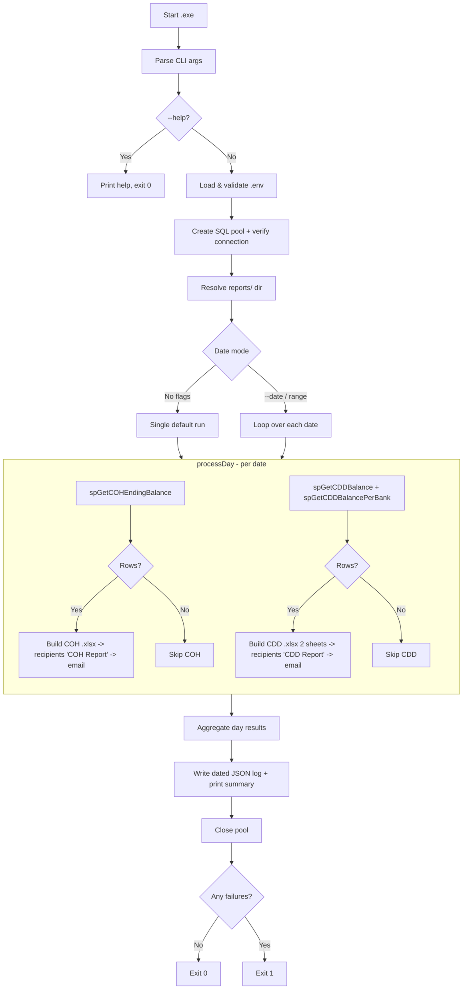
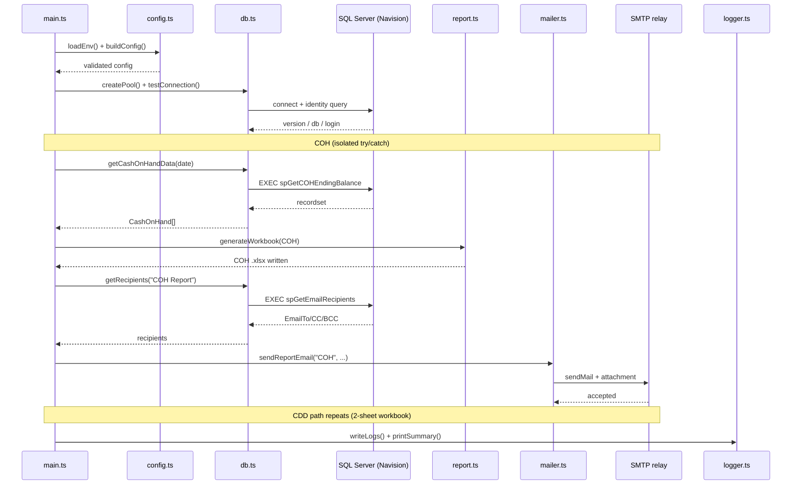

# COH / CDD Console Application

## What It Is

COH / CDD Email Delivery is a standalone console application that runs once daily to generate and email the Treasury/Operations team's daily financial reports — **Cash on Hand (COH)**, **Cash Delivery Deposit (CDD)**, and **CDD Per Bank**. It executes existing SQL Server stored procedures, formats the results into Excel (`.xlsx`) workbooks, and emails each workbook as an attachment to recipients that are also fetched from the database.

It replaces a legacy production .NET console app whose **source code was lost** and which had no error handling, logging, or diagnostics. This rewrite is a like-for-like replacement from the recipients' perspective, but adds graceful error handling, structured logging, and clear success/failure exit codes.

It is built with **Deno** and compiled to a **single Windows executable** (`.exe`) via `deno compile`, so it can be dropped onto a server and run by **Windows Task Scheduler** or a **SQL Agent Job** with no runtime to install.

## Where It Lives

| What | Where |
|---|---|
| **Source repo** | [GitHub](https://github.com/lowiedichoson/coh-cdd-email-delivery) |
| **Production host** | Ask IT Administrators |
| **Server** | Ask IT Administrators |
| **Database(s)** | `Navision` (SQL Server) |

## Tech Stack

| Layer | Technology |
|---|---|
| **Language** | TypeScript |
| **Runtime** | Deno 2.x |
| **Packaging** | `deno compile` → standalone Windows `.exe` |
| **Database** | SQL Server via `npm:mssql` (tedious driver) |
| **Excel** | `npm:xlsx` (SheetJS) — multi-sheet `.xlsx` |
| **Email** | `npm:nodemailer` — SMTP client |
| **Config** | `.env` via `@std/dotenv` |
| **Console/Logging** | `chalk` + dated JSON log files |
| **Scheduling** | Windows Task Scheduler or SQL Agent Job (external) |

All dependencies are pure JavaScript (no native addons), so they bundle cleanly into the compiled `.exe`.

## Architecture & Process Flow

### Module structure

The codebase is a set of small, single-responsibility TypeScript modules:

| Module | Responsibility |
|---|---|
| **main.ts** | Orchestrator / entry point. Parses CLI args, loads config, opens the DB pool, then runs `processDay` for each date. Handles per-report isolation, aggregates results, and sets the exit code. |
| **config.ts** | Loads and validates the `.env` file (fails fast on missing keys) and builds the `mssql` connection config. |
| **db.ts** | All SQL Server access — creates the connection pool, verifies connectivity, and calls each stored procedure, mapping rows to typed interfaces. |
| **report.ts** | Builds the Excel workbooks with SheetJS — applies `COLUMN_LABELS`, a title row, and computed `Total` rows. |
| **mailer.ts** | Builds the SMTP transport and sends one email per report (subject/body match the legacy app; `[TEST] -` prefix unless `IS_PRODUCTION=true`). |
| **paths.ts** | Executable-relative path resolution and CLI argument parsing (single date or date range). |
| **logger.ts** | Colored console output mirrored to a dated JSON log file, plus the end-of-run summary. |
| **types.ts** | Shared TypeScript interfaces (report rows, recipients, config, per-day results). |
| **scripts/** | The four SQL Server stored procedures the app depends on. |

### Stored procedures

| Procedure | Purpose | Parameter |
|---|---|---|
| `spGetCOHEndingBalance` | Cash on Hand per branch | `@TransactionDate` (optional) |
| `spGetCDDBalance` | Cash Delivery Deposit per branch | `@TransactionDate` (optional) |
| `spGetCDDBalancePerBank` | CDD aggregated per bank | `@TransactionDate` (optional) |
| `spGetEmailRecipients` | Recipient lists (`EmailTo`/`EmailCC`/`EmailBCC`, semicolon-delimited) keyed by `NotificationModule` (`"COH Report"` / `"CDD Report"`) | `@NotificationModule` |

### Reports produced

- **COH workbook** — one sheet (`COH Ending Balance`).
- **CDD workbook** — two sheets (`CDD Ending Balance` + `CDD Balance Per Bank`).

COH and CDD are processed **independently** — a failure in one does not block the other, and partial success is captured per day. If a stored procedure returns **no rows**, that report is skipped (no file, no email).

### Notable implementation details

- **Recipients come from the database**, not `.env` — one `spGetEmailRecipients` call per report module. Missing recipient rows or an empty `EmailTo` throws and fails that report.
- **Timezone-safe dates:** `@TransactionDate` is passed as `NVARCHAR` (`YYYY-MM-DD`) rather than a `DateTime`, to avoid the `mssql` driver shifting a local midnight into the previous UTC day and causing the SP's date comparisons to miss.
- **Executable-relative paths:** `.env`, `logs/`, and `reports/` are resolved next to the running `.exe` (or the source tree in dev), so the working directory doesn't matter.
- **CLI date modes:** no flags = one default run (SPs use their own internal default date); `-d/--date` = a single day; `--date-from [--date-to]` = an inclusive range (through yesterday if `--date-to` is omitted).
- **Exit codes:** `0` on success, `1` if any day/report failed — this is what the scheduler/SQL Agent job keys off of.

### Runtime flow

### Single-day sequence

## Access

| What | How to Get It |
|---|---|
| **Server access** | Ask IT Administrators |
| **Database access** | Ask IT Administrators |
| **Configuration** | Settings live in a `.env` file placed next to the executable (DB + SMTP credentials) |

> ⚠️ **Never store passwords or connection strings here.** Just say who to contact.

## Deployment

- **Method:** Manual — build with `deno task compile`, then copy the `.exe` and `.env` to the target server
- **Runtime layout:** place the `.exe`, `.env`, `logs/`, and `reports/` together in one folder
- **Pipeline:** None
- **Scheduling:** Windows Task Scheduler or SQL Agent Job runs the `.exe` once per day
- **Who deploys:** Developers
- **Rollback:** Replace the `.exe` and `.env` with the previous version — there is no local state beyond logs and report files

## Dependencies

| System / Service | How It Depends | What Breaks If It's Down |
|---|---|---|
| **SQL Server (`Navision`)** | Source of all report data and the recipient lists, via the four stored procedures | No reports can be generated and no emails are sent; the run fails |
| **Stored procedures** | `spGetCOHEndingBalance`, `spGetCDDBalance`, `spGetCDDBalancePerBank`, `spGetEmailRecipients` must exist and be executable by the DB account | The corresponding report (or recipient lookup) fails |
| **SMTP relay** | Used to deliver each report email with its attachment | Reports are generated and saved, but no emails are delivered |
| **`.env` file** | Supplies all DB and SMTP connection settings next to the executable | The app fails fast on startup if required variables are missing |

## Who to Ask

| Team / Department | What They Know |
|---|---|
| **Developer Team** | Backend, stored procedures, and app ownership |
| **Operations / DBAs** | Scheduling, monitoring, logs, and exit codes |
| **Treasury Operations** | Daily process and report recipients |

## Handover Notes

### Known Tech Debts

- **No retry / backoff (FR-15).** Transient DB or SMTP errors are not retried — a blip fails that report for the day. Re-running the day is manual.
- **No dedup ledger (FR-16).** There is no guard against double-sending. Running the same date twice will generate and email the reports again — take care when re-running for a date that already succeeded.
- **`.xlsx` only.** The app outputs modern Excel (`.xlsx`) via SheetJS; it does not produce the legacy `.xls` (BIFF) format. Confirm recipients/downstream tooling are fine with `.xlsx`.

---

*Last updated: July 2026*
