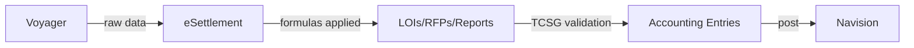

# Backend Formulas in eSettlement System

## Who Asks

| | |
|---|---|
| **Requested by** | Accounting Department or External Auditors |
| **How they ask** | Email, Sapphire Ticket, In-person |
| **Frequency** | Ad-hoc |

## What It Is

eSettlement sources data from Voyager and applies backend formulas to produce settlement LOIs and RFPs. Once TCSG manually validates the output, the data undergoes further processing into accounting entries, which Accounting then posts into Navision.

## When This Request Happens

- Accounting requests this during verification to confirm that bridge entries align with eSettlement's processed data.
- Auditors request this to validate the same alignment between bridge entries and processed data.

## Prerequisites

- Familiarity with the integration between Voyager, eSettlement, and Navision, and their underlying backend processes.

## High-level Diagram of the Systems



---

## Gross Commission, Share in FX, and Output VAT Formulas
> The formulas in this section come from the stored procedure executed in the `Process Voyager Data` module of the eSettlement system — specifically `[dbo].[spProcessTxnPH943]` from the `[BridgeDb]` database.

### List of columns from ***Voyager Daily Report***

> ***The list below contains the columns used in the backend formulas of eSettlement.***

- Direction
- ClearChargesLOC
- ClearFXLOC
- ClearPrincipalLOC
- RecPrincipalLOC
- TotalChargesLOC
- SendPayIndicator

Let:

- **VAT Rate** = 0.12

- ***Direction*** = `I` → **WU Commission Rate** = 0.18

- ***Direction*** = `P`, `R`, `O`, `Q` → **WU Commission Rate** = 0.22

- ***Direction*** = `S` → **WU Commission Rate N** = 0.50

---

### For transactions where `Direction = I`

```
Gross Commission = ClearChargesLOC  
Share in FX = ClearFXLOC 
Output VAT = 0  
```

---

### For transactions where `Direction = P`

```
Gross Commission = ClearChargesLOC / (1 + VAT Rate)
Share in FX = ClearFXLOC / (1 + VAT Rate)
Output VAT = 1 * (Gross Commission + Share in FX) * (VAT Rate)
```

---

### For transactions where `Direction = O`

**1. `IF ProductCode = CAZS`**

```
Gross Commission = ClearChargesLOC / (1 + VAT Rate)
Share in FX      = (ClearPrincipalLOC - RecPrincipalLOC + ClearFXLOC) / (1 + VAT Rate)
Output VAT       = 1 * (Gross Commission + Share in FX) * VAT Rate
```

**2. `ELSE`**

- **`IF ClearFXLOC > 0`**

```
Gross Commission = -1 * ( (ClearChargesLOC / (1 - WU Commission Rate)) * WU Commission Rate / (1 + VAT Rate) )
Share in FX     = -1 * ( (RecPrincipalLOC + TotalChargesLOC - (ClearPrincipalLOC + ClearChargesLOC + ClearFXLOC)) - (ClearChargesLOC / (1 - WU Commission Rate) * WU Commission Rate) ) / (1 + VAT Rate)
```

- **`ELSE`**

```
Gross Commission = -1 * ( (RecPrincipalLOC + TotalChargesLOC - (ClearPrincipalLOC + ClearChargesLOC + ClearFXLOC) ) ) / (1 + VAT Rate)
Share in FX = 0
```

- **Outside of `IF ELSE`**

```
Output VAT = 1 * (Gross Commission * VAT Rate)
```

---

### For transactions where `Direction = Q`

**1. `IF ClearFXLOC > 0`**

```
Gross Commission = -1 * ( (ClearChargesLOC / (1 - WU Commission Rate)) * WU Commission Rate / (1 + VAT Rate) )
Share in FX     = -1 * ( (RecPrincipalLOC + TotalChargesLOC - (ClearPrincipalLOC + ClearChargesLOC + ClearFXLOC)) - (ClearChargesLOC / (1 - WU Commission Rate) * WU Commission Rate) ) / (1 + VAT Rate)
```

**2. `ELSE`**

```
Gross Commission = -1 * ( (RecPrincipalLOC + TotalChargesLOC - (ClearPrincipalLOC + ClearChargesLOC + ClearFXLOC) ) ) / (1 + VAT Rate)
Share in FX = 0
```

**3. Outside of `IF ELSE`**

```
Output VAT = 1 * (Gross Commission * VAT Rate)
```

---

### For transactions where `Direction = S`

**1. `IF ClearFXLOC > 0`**

```
Gross Commission = -1 * ( (ClearChargesLOC / (1 - WU Commission Rate N)) * WU Commission Rate N / (1 + VAT Rate) )
Share in FX     = -1 * ( (RecPrincipalLOC + TotalChargesLOC - (ClearPrincipalLOC + ClearChargesLOC + ClearFXLOC)) - (ClearChargesLOC / (1 - WU Commission Rate N) * WU Commission Rate N) ) / (1 + VAT Rate)
```

**2. `ELSE`**

```
Gross Commission = -1 * ( (RecPrincipalLOC + TotalChargesLOC - (ClearPrincipalLOC + ClearChargesLOC + ClearFXLOC) ) ) / (1 + VAT Rate)
Share in FX = 0
```

**3. Outside of `IF ELSE`**

```
Output VAT = 1 * (Gross Commission + Share in FX) * VAT Rate
```

## Finalization of Gross Commission, Share in FX, and Output VAT
> After the system processes the transactions using their respective formulas depending on their ***Direction*** column value, the ***gross commission, share in fx, and output vat*** get updated for finalization at a later stage of the stored procedure.

- **If the transaction is from a branch and its `SendPayIndicator` value is `S`**
	- **`IF Direction = S`**
		- `Gross Commission = Gross Commission / 2`
		- `Output VAT = 1 * (Share in FX + Gross Commission) * VAT Rate`
		  
	- **`ELSE`**
		- **`IF ProductCode IS NOT CAZS`**
			- `Gross Commission = 0`
			- `Output VAT = 1 * Share in FX * VAT Rate`

---
*Last updated: June 2026*
