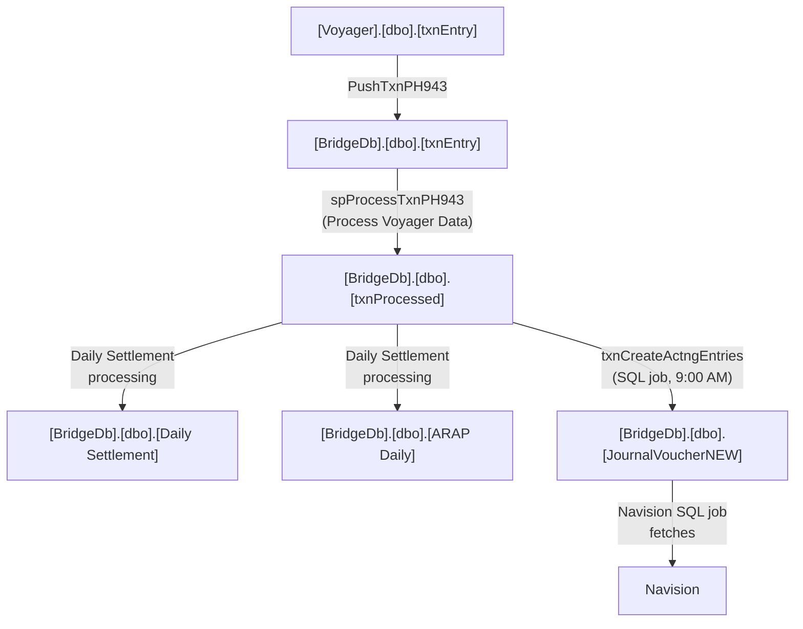

# eSettlement Database

## Overview

eSettlement spans three databases — `BridgeDb`, `Voyager`, and `Treasury`. This page documents the tables, views, and stored procedures you'll commonly encounter during debugging, reporting, and maintenance tasks.

> For the formulas behind the computed values for `[dbo].[txnProcess]` table, see [Backend Formulas](backend-formulas.md).

---

## Database Summary

| Database | Purpose | When You Query It |
|---|---|---|
| `BridgeDb` | Core database of the esettlement system where its main tables are housed | [e.g., Debugging bridge entry issues, checking processed transactions] |
| `Voyager` | Raw source data | [e.g., Tracing raw transaction data before processing] |
| `Treasury` | [e.g., Accounting / financial entries — holds data ready for Navision posting] | [e.g., Verifying accounting entries before transfer to Navision] |

---

## BridgeDb

### Key Tables

| Table | What It Stores | Used In |
|---|---|---|
| `[dbo].[ARAP Daily]` | Accounts receivables and accounts payables on a daily basis | *Process Daily Settlement* module |
| `[dbo].[Audit_Trail_Pocket]` | User event / action logs | [Process / module] |
| `[dbo].[brsaAccount]` | API / APZ accounts provisioned by Western Union, used by branches or sub-agents in their PHP / USD transactions | Branch/Subagent Maintenance |
| `[dbo].[brsaDetail]` | Related to `[dbo].[brsaAccount]` — stores branch name, type (branch or sub-agent), and other branch / sub-agent information | Branch/Subagent Maintenance |
| `[dbo].[JournalVoucherNEW]` | Stores the bridge accounting entries | *Create Accounting Entries* module |
| `[dbo].[PDSRate]` | Stores the PDS rate on a daily basis | *PDS Rate* module |
| `[dbo].[RFP]` | Stores request for payment information | *RFP* module |
| `[dbo].[RFPDetails]` | Stores request for payment amounts (related to `[dbo].[RFP]`) | *RFP* module |
| `[dbo].[txnEntry]` | Copy of the `[dbo].[txnEntry]` table from the Voyager database, with fewer columns — stores the raw data that will be processed into `[dbo].[txnProcessed]` | *Retrieve Voyager Data* module |
| `[dbo].[txnProcessed]` | Processed version of the data from `[dbo].[txnEntry]` — this is where the bridge accounting entries originate from | *Process Voyager Data* module |
| `[dbo].[wuRates]` | Stores the rates for withholding tax, VAT rate, WU commission, and Voyager rate | Transaction-related processing |
| `[dbo].[Users]` | Stores user account information | User Maintenance |
| `[dbo].[CreatedEntries]` | Stores the list of dates the system have created the bridge entries for | Creation of entries |

### Key Stored Procedures

| Stored Procedure | What It Does | Called By |
|---|---|---|
| `[dbo].[spProcessTxnPH943]` | Populates the `[dbo].[txnProcessed]` table by computing Gross Commission, Share in FX, and Output VAT for WU transactions | *Process Voyager Data* module |
| `[dbo].[txnCreateActngEntries]` | Creates the bridge accounting entries based on data from `[dbo].[txnProcessed]` | SQL job (daily at 9:00 AM) |

---

## Voyager

### Key Tables

| Table | What It Stores | Used In |
|---|---|---|
| `[dbo].[genUser]` | Stores user account information | [Process / module] |
| `[dbo].[impHistory]` | Audit logs for the history of imported files from WUSFG | [Process / module] |
| `[dbo].[nacAccount]` | API / APZ accounts of branches / sub-agents | [Process / module] |
| `[dbo].[nacLocation]` | Branch / sub-agent owner information tied to the API / APZ accounts | [Process / module] |
| `[dbo].[txnEntry]` | Stores the raw transaction data that gets pushed to eSettlement's `[BridgeDb].[dbo].[txnEntry]` table | Data source for processing |

### Key Stored Procedures

| Stored Procedure | What It Does | Called By |
|---|---|---|
| `[dbo].[PushTxnPH943]` | Pushes transactions from `[Voyager].[dbo].[txnEntry]` to `[BridgeDb].[dbo].[txnEntry]` | *Process Voyager Data* module |

---

## Common Lookup Patterns

> Practical scenarios — "I need to do X → here's where to look."

| Scenario | Where to Look | Notes |
|---|---|---|
| **Leftover transactions not on bridge reports after TCSG process** | Inspect the inner-joined query inside `[Voyager].[dbo].[PushTxnPH943]` | The API / APZ accounts of the leftover transactions may not be configured properly in `[Voyager].[dbo].[nacLocation]` and `[Voyager].[dbo].[nacAccount]`. Verify the account mappings in those tables. |
| **Bridge entries not transferred to Navision (accounting dept. inquiry)** | `[BridgeDb].[dbo].[CreatedEntries]` — `ORDER BY transaction_date DESC`, limit rows | If the transaction date you're looking for is not present, the SQL job (`txnCreateActngEntries`) likely did not cover that date. See [Re/create Bridge Entries](../../common-requests/001-recreation-of-bridge-entries.md) for further instructions on recreating bridge entries. |

---

## Table Relationships

> Describe how key tables relate across databases. This can be a simple bullet list or a Mermaid diagram.

Or as text:

- `[Voyager].[dbo].[txnEntry]` → `[BridgeDb].[dbo].[txnEntry]` (pushed by `PushTxnPH943`)
- `[BridgeDb].[dbo].[txnEntry]` → `[BridgeDb].[dbo].[txnProcessed]` (processed by `spProcessTxnPH943` in *Process Voyager Data*)
- `[BridgeDb].[dbo].[txnProcessed]` → `[BridgeDb].[dbo].[Daily Settlement]` and `[BridgeDb].[dbo].[ARAP Daily]` (daily settlement processing)
- `[BridgeDb].[dbo].[txnProcessed]` → `[BridgeDb].[dbo].[JournalVoucherNEW]` (generated by `txnCreateActngEntries` via SQL job at 9:00 AM)
- `[BridgeDb].[dbo].[JournalVoucherNEW]` → Navision (fetched by a SQL job on the Navision database server)

---

*Last updated: June 2026*
