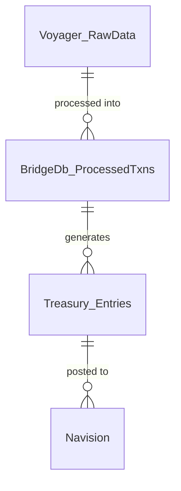

# Common Database Tables in eSettlement

## Overview

eSettlement spans three databases — `BridgeDb`, `Voyager`, and `Treasury`. This page documents the tables, views, and stored procedures you'll commonly encounter during debugging, reporting, and maintenance tasks.

> For the formulas behind the computed values, see [Backend Formulas](backend-formulas.md).

---

## Database Summary

| Database | Purpose | When You Query It |
|---|---|---|
| `BridgeDb` | [e.g., Core processing — holds transaction staging, bridge entries, and formula outputs] | [e.g., Debugging bridge entry issues, checking processed transactions] |
| `Voyager` | [e.g., Raw source data — receives WU transaction data from WUSFG] | [e.g., Tracing raw transaction data before processing] |
| `Treasury` | [e.g., Accounting / financial entries — holds data ready for Navision posting] | [e.g., Verifying accounting entries before transfer to Navision] |

---

## BridgeDb

### Key Tables

| Table | What It Stores | Used In | Key Columns / Notes |
|---|---|---|---|
| `[TABLE_NAME]` | [Description] | [Process / module] | `[Column1]`, `[Column2]`, `[Column3]` |
| `[TABLE_NAME]` | [Description] | [Process / module] | `[Column1]`, `[Column2]` |

> Add or remove rows as needed. Only include tables you actually query day-to-day — skip lookup/config tables unless they've caused issues before.

### Key Stored Procedures

| Stored Procedure | What It Does | Called By |
|---|---|---|
| `[dbo].[spProcessTxnPH943]` | Computes Gross Commission, Share in FX, and Output VAT for WU transactions | *Process Voyager Data* module |
| `[dbo].[sp_...]` | [Description] | [Module / job] |

### Views (if any)

| View | What It Returns | Used In |
|---|---|---|
| `[dbo].[vw_...]` | [Description] | [Process] |

---

## Voyager

### Key Tables

| Table | What It Stores | Used In | Key Columns / Notes |
|---|---|---|---|
| `[TABLE_NAME]` | [Description — e.g., Raw daily transaction report from WU] | [Process] | `Direction`, `ClearChargesLOC`, `ClearFXLOC`, `ClearPrincipalLOC`, `RecPrincipalLOC`, `TotalChargesLOC`, `SendPayIndicator` |
| `[TABLE_NAME]` | [Description] | [Process] | `[Column1]`, `[Column2]` |

### Key Stored Procedures

| Stored Procedure | What It Does | Called By |
|---|---|---|
| `[dbo].[sp_...]` | [Description] | [Module / job] |

---

## Treasury

### Key Tables

| Table | What It Stores | Used In | Key Columns / Notes |
|---|---|---|---|
| `[TABLE_NAME]` | [Description] | [Process] | `[Column1]`, `[Column2]` |
| `[TABLE_NAME]` | [Description] | [Process] | `[Column1]`, `[Column2]` |

### Key Stored Procedures

| Stored Procedure | What It Does | Called By |
|---|---|---|
| `[dbo].[sp_...]` | [Description] | [Module / job] |

---

## Common Lookup Patterns

> Practical scenarios — "I need to do X → here's where to look."

| Scenario | Where to Look | Notes |
|---|---|---|
| **Find all unprocessed transactions** | `[Database].[dbo].[Table]` — filter by `[StatusColumn]` | [Any caveats] |
| **Trace a specific Voyager transaction** | Start at `[Voyager].[dbo].[Table]`, filter by `[TransactionId]` | [Any caveats] |
| **Check what accounting entries were generated for a date** | `[Treasury].[dbo].[Table]` — filter by `[DateColumn]` | [Any caveats] |
| **Debug a bridge entry that won't post** | `[BridgeDb].[dbo].[Table]` — check `[StatusColumn]` | [Any caveats] |
| **[Add your own scenario]** | `[Database].[dbo].[Table]` | [Notes] |

---

## Table Relationships

> Describe how key tables relate across databases. This can be a simple bullet list or a Mermaid diagram.

Or as text:

- Voyager `[TableA]` → BridgeDb `[TableB]` (joined on `[Column]`)
- BridgeDb `[TableB]` → Treasury `[TableC]` (joined on `[Column]`)

---

*Last updated: June 2026*
