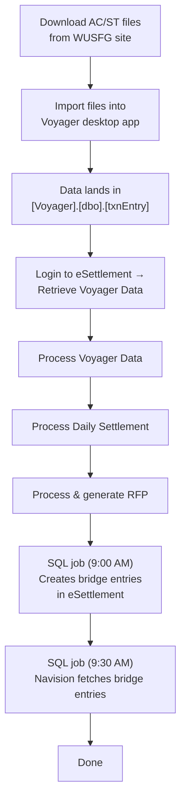

# TCSG Daily Process

A high-level walkthrough of the daily routine performed by TCSG, spanning Voyager, eSettlement, and Navision.

---

## Overview

TCSG processes WU (Western Union) transactions daily. The workflow starts with downloading files from the WUSFG site and ends with bridge entries auto-fetched into Navision. Steps 1–3 happen in the Voyager desktop application; steps 4–7 happen inside the eSettlement web application; steps 8–9 are automated SQL jobs.

| Step | Where | Action |
|:---:|---|---|
| 1 | WUSFG Site | Download AC/ST files |
| 2 | Voyager Desktop | Import the downloaded files |
| 3 | Voyager DB | Data becomes available in `[dbo].[txnEntry]` |
| 4 | eSettlement | *Retrieve Voyager Data* — fetches data from Voyager into `[BridgeDb].[dbo].[txnEntry]` |
| 5 | eSettlement | *Process Voyager Data* — runs `spProcessTxnPH943`, populates `[dbo].[txnProcessed]` |
| 6 | eSettlement | *Process Daily Settlement* — populates `[dbo].[Daily Settlement]` and `[dbo].[ARAP Daily]` |
| 7 | eSettlement | *RFP* — processes and generates Request for Payment |
| 8 | SQL Job (9:00 AM) | `txnCreateActngEntries` auto-creates bridge entries in `[dbo].[JournalVoucherNEW]` |
| 9 | SQL Job (9:30 AM) | Navision's SQL job auto-fetches the bridge entries from eSettlement |\

---

*Last updated: June 2026*

