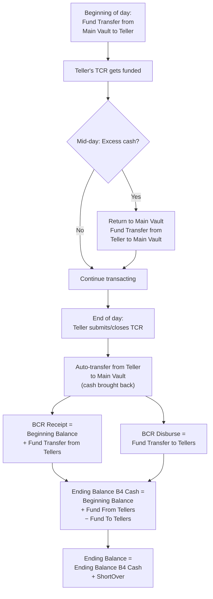

# BCR Simulation

## What It Is

BCR stands for **Branch Cash Report** — the system's record of a branch's cash movement from teller to main vault, main vault to teller, and their ending balances derived from the tellers' cash reports (TCR). This query simulates the exact computation that runs when a teller submits their branch's cash report.

---

## High-Level Flow



| Concept | Meaning |
|---|---|
| **Beginning Balance** | Yesterday's ending balance of the BCR |
| **Fund Transfer from Teller** | Cash returned to main vault mid-day (excess) + auto-transfer upon TCR submission (EOD) |
| **Fund Transfer to Teller** | Cash given from main vault to fund a teller's TCR at the start of the day |
| **Ending Balance B4 Cash** | `Beginning Balance + Fund from Tellers − Fund to Tellers` — the accountability before cash denomination |
| **Ending Balance** | `Ending Balance B4 Cash + ShortOver` — final cash position after discrepancies |

---

## BCR Simulation Query

This query replicates the closing computation from the `[E-Business Services Inc_$AR Main Vault]` table in the Navision database. It computes beginning balance, fund transfers to/from tellers, teller ending totals, and the final branch cash position.

### 1. Declare parameters

```sql
-- params
DECLARE @TransactionDate DATETIME = '2026-06-18';
DECLARE @BranchCode VARCHAR(10) = '2.32.012';
DECLARE @OperatorId VARCHAR(3) = '027';
DECLARE @CurrencyCode VARCHAR(3) = 'PHP';
```

### 2. Run the simulation

```sql
-- bcr simulation
-- author: lowie
-- created date: 2026-06-19
-- description: simulation of bcr's computation upon closing

-- bcr values
declare 
	@BeginningBalance as decimal(18,2), -- beginning balance, based from yesterday's ending balance
	@FundTransferFromTeller decimal(18,2), -- fund transfers from teller to main vault
	@FundTransferToTeller decimal(18,2), -- fund transfers to teller from main vault
	@EndingBalanceB4Cash decimal(18,2), -- total accountability 
	@BillsTotalAmount decimal(18,2), -- total cash denomination
	@EndingBalance decimal(18,2), -- ending balance after calculating accountability against cash denomination
	@TotalTellerEnding decimal(18,2), -- total ending balance of tellers (from TCR)
	@ShortOver decimal(18,2) = 0,
	@Floating decimal(18,2)


SELECT TOP 1 
	@BeginningBalance = ISNULL([Ending Balance], 0) 
from [E-Business Services Inc_$AR Main Vault] 
where [ARMV Date] < @TransactionDate 
and [Currency Code] = @CurrencyCode 
and Closed = 1 
and [Branch Code] = @BranchCode order by [ARMV Date] desc;

select 
	@FundTransferFromTeller = ([Transfer from Teller1] + [Transfer from Teller2] + [Transfer from Teller3] + [Transfer from Teller4] + [Transfer from Teller5]), 
	@FundTransferToTeller = ([Transfer to Teller1] + [Transfer to Teller2] + [Transfer to Teller3] + [Transfer to Teller4] + [Transfer to Teller5]), 
	@TotalTellerEnding = ([Teller 1 Ending] + [Teller 2 Ending]+[Teller 3 Ending]+[Teller 4 Ending]+[Teller 5 Ending])
from [E-Business Services Inc_$AR Main Vault] 
where [ARMV Date] = @TransactionDate 
and [Currency Code] = @CurrencyCode 
--and Closed = 0 
and [Branch Code] = @BranchCode

set @EndingBalanceB4Cash = (@BeginningBalance + @FundTransferFromTeller - @FundTransferToTeller)
set @EndingBalance = (@EndingBalanceB4Cash + @ShortOver)

SELECT
	@BillsTotalAmount =
		([Bills of 1000] * 1000) + 
		([Bills of 500] * 500) + 
		([Bills of 200] * 200) + 
		([Bills of 100] * 100) + 
		([Bills of 50] * 50) +
		([Bills of 20] * 20) +
		([Bills of 10] * 10) +
		([Bills of 5] * 5) +
		([Bills of 2] * 2) +
		([Bills of 1] * 1) +
		([Bills of _25] * .25) +
		([Bills of _10] * .10) +
		([Bills of _05] * .05)
from [E-Business Services Inc_$AR Main Vault] 
where [ARMV Date] = @TransactionDate 
and [Currency Code] = @CurrencyCode 
--and Closed = 0 
and [Branch Code] = @BranchCode


SELECT
	@BeginningBalance [BeginningBalance],
	@FundTransferFromTeller [FundTransferFromTeller],
	@FundTransferToTeller [FundTransferToTeller],
	@TotalTellerEnding [TotalTellerEnding],
	@EndingBalanceB4Cash [EndingBalanceB4Cash],
	@EndingBalance [EndingBalance],
	@BillsTotalAmount [BillsTotalAmount]
```

### 3. Understanding the output

| Column | Meaning |
|---|---|
| `BeginningBalance` | Yesterday's ending balance from the last closed BCR |
| `FundTransferFromTeller` | Sum of transfer from Teller 1–5 (mid-day returns + EOD auto-transfer upon TCR submission) |
| `FundTransferToTeller` | Sum of transfer to Teller 1–5 (funding teller TCRs at the start of the day) |
| `TotalTellerEnding` | Total of Teller 1–5 ending balances from their TCRs |
| `EndingBalanceB4Cash` | `BeginningBalance + FundTransferFromTeller − FundTransferToTeller` |
| `EndingBalance` | `EndingBalanceB4Cash + ShortOver` — final balance after discrepancies |
| `BillsTotalAmount` | Cash denomination computed from bill/coin breakdown (1000 × ₱1000 + 500 × ₱500 + ...) |

---

*Last updated: June 2026*

