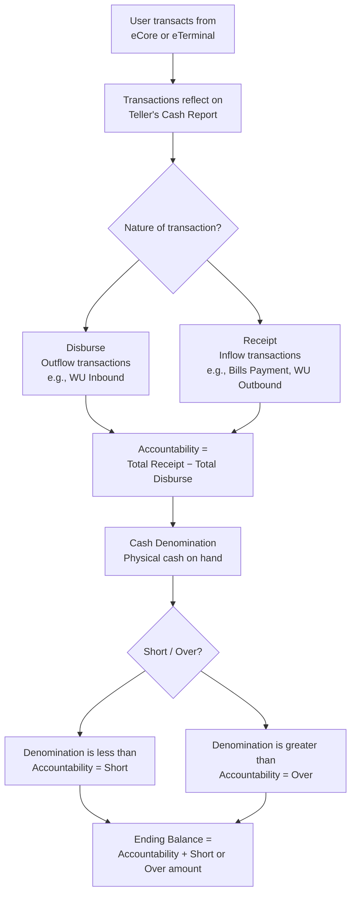

# TCR Simulation

## What It Is

TCR stands for **Teller's Cash Report** — the system's record of a teller's total accountability and cash denomination for a given shift. When investigating TCR-related issues (e.g., shortages, overages, disappearing transactions), this query simulates the exact computation that runs when a teller submits or closes their TCR.

---

## High-Level Flow



| Concept | Meaning |
|---|---|
| **Total Receipt** | Transactions where the teller accepts cash from the client (bills payment, WU outbound, airline ticketing, etc.) |
| **Total Disburse** | Transactions where the teller pays out cash to the client (WU inbound, refunds, cancellations, etc.) |
| **Accountability** | `Total Receipt − Total Disburse` — the amount the system expects you to have in your vault based on recorded transactions |
| **Cash Denomination** | The system's actual recording of the physical cash you hold in hand |
| **Short / Over** | `Denomination − Accountability` — negative means short, positive means over |
| **Ending Balance** | `Accountability + ShortOver` — the final cash position after accounting for discrepancies |

---

---

> **📝 Note on TCR lifecycle**
>
> The teller's cash report data initially lives in `[dbo].[E-Business Services Inc_$AR Topsheet]`. When the teller submits or **closes** their TCR, the system:
>
> 1. **Copies** the data (with cash denomination) to `[dbo].[E-Business Services Inc_$AR Topsheet to Main Vault]` — this becomes the permanent record.
> 2. **Zeroes out** the cash denomination columns in `[dbo].[E-Business Services Inc_$AR Topsheet]` — preparing it for the next day.
>
> In short: `Topsheet` = active teller cash report, `Topsheet to Main Vault` = finalized record after closing.

## TCR Simulation Query

This query replicates the closing computation from the `[E-Business Services Inc_$AR Topsheet]` table in the Navision database. It computes total receipts, total disbursements, short/over, and ending balance for a specific teller, branch, date, and currency.

### 1. Declare parameters

```sql
DECLARE @TransferAmount AS DECIMAL(18, 2);
DECLARE @CurrencyCode VARCHAR(10) = 'PHP';
DECLARE @TransactionDate AS DATETIME = '2026-03-04';
DECLARE @BranchCode AS VARCHAR(20) = '2.32.009';
DECLARE @UserId VARCHAR(3) = '316';
```

### 2. Run the simulation

```sql
DECLARE @TotalR DECIMAL(18, 2),
        @TotalD DECIMAL(18, 2),
        @EndingBalance DECIMAL(18, 2),
        @EndingB4Cash DECIMAL(18, 2),
        @ShortOver DECIMAL(18, 2),
        @BillsTotalAmount DECIMAL(18, 2),
        @varOver DECIMAL(18, 2),
        @varShort DECIMAL(18, 2),
        @ShortAmount DECIMAL(18, 2),
        @OverAmount DECIMAL(18, 2),
        @Floating DECIMAL(18, 2);

SET @ShortAmount = 0;
SET @OverAmount = 0;

IF @CurrencyCode = 'PHP'
BEGIN

    SELECT
        @BillsTotalAmount = [Bills Total Amount],
        @OverAmount       = [Over Amount],
        @ShortAmount      = [Short Amount],
        @TotalR = (
            [Beginning Balance]
            + [Transfer from MV]
            + [Transfer from Bank]
            + [Transfer from Treasury]
            + [Transfer from Armored]
            + [Transfer from Other Branch]
            + [Transfer from Teller]
            + [WU Outbound]
            + [WU PGC]
            + [Receipt from DST Collection]
            + [Receipt from Dollar Sale]
            + [Bayad Center Payment]
            + [EC-PaySmart]
            + [EC-PayGlobe]
            + [EC-PaySun]
            + [EC-PayTextAPIN]
            + [Scratch It]
            + [PhilEquity Amount Invested]
            + [Cebu Pacific]
            + [Zest Air]
            + [Adjustment]
            + [SIM Card]
            + [VIA]
            + [FETA]
            + [Miscellaneous]
            + [DepEd]
            + [Phil Airlines]
            + [PRN]
            + [ECLOAD]
            + [ECBILLS]
            + [ECCASH]       -- Added JC 2021-11-08
            + [PHOENIXELOAD]
            + [Air Asia]
            + [Cebuana Outbound]
            + [TransFast Outbound]
            + [WU Unpay]
            + [Cebuana Unpay]
            + [TransFast Unpay]
            + [USSC Outbound] -- Added 02/25/2021
            + [USSC Unpay]    -- Added 02/25/2021
            + [Remitly Outbound]
            + [Remitly Unpay]
            + [Ria Outbound]
            + [Ria Unpay]
        )
    FROM [Navision].[dbo].[E-Business Services Inc_$AR Topsheet to Main Vault]
    --FROM [Navision].[dbo].[E-Business Services Inc_$AR Topsheet]
    WHERE [Operator ID]  = @UserID
      AND [Currency Code] = @CurrencyCode
      AND [TopSheet Date] = @TransactionDate
      AND [Branch Code]   = @BranchCode;

    SELECT @TotalD = (
        [Return to MV]
        + [Fund Transfer to Bank]
        + [Fund Transfer to Branch]
        + [Fund Transfer to Treasury]
        + [Mutilated Bills]
        + [WU Inbound]
        + [Disbursement for USD Purchase]
        + [Branch Expenses]
        + [Utility Expenses]
        + [Scratch IT Payment for Winning]
        + [Cash Advance 1]
        + [Unliquidated Branch Expense 1]
        + [Cebu Pacific Refund]
        + [Zest Air Refund]
        + [VIA Refund]
        + [FETA Refund]
        + [Phil Airlines Refund]
        + [Air Asia Refund]
        + [MCOSTS]
        + [Cebuana Inbound]
        + [Cebuana International Inbound]
        + [TransFast Inbound]
        + [WU Refund]
        + [WU Cancel]
        + [Cebuana Refund]
        + [Cebuana Cancel]
        + [Starpay]
        + [USSC Inbound]   -- Added 02/25/2021
        + [USSC Refund]    -- Added 02/25/2021
        + [USSC Cancel]    -- Added 02/25/2021
        + [Remitly Inbound]
        + [Ria Inbound]
    )
    FROM [Navision].[dbo].[E-Business Services Inc_$AR Topsheet to Main Vault]
    --FROM [Navision].[dbo].[E-Business Services Inc_$AR Topsheet]
    WHERE [Operator ID]  = @UserID
      AND [Currency Code] = @CurrencyCode
      AND [TopSheet Date] = @TransactionDate
      AND [Branch Code]   = @BranchCode;

    SET @EndingB4Cash = @TotalR - @TotalD;
    SET @ShortOver    = @OverAmount - @ShortAmount;
    SET @EndingBalance = @EndingB4Cash + @ShortOver;
    SET @Floating      = @EndingBalance - @BillsTotalAmount;

END

SELECT
    @TransactionDate  [TransactionDate],
    @BranchCode       [BranchCode],
    @BillsTotalAmount [BillsTotalAmount],
    @OverAmount       [OverAmount],
    @ShortAmount      [ShortAmount],
    @TotalR           [TotalReceipts],
    @TotalD           [TotalDisbursements],
    @EndingB4Cash     [EndingB4Cash],
    @ShortOver        [ShortOver],
    @EndingBalance    [EndingBalance],
    @Floating         [Floating];
```

### 3. Understanding the output

| Column | Meaning |
|---|---|
| `TotalReceipts` | Sum of all inflow transaction types |
| `TotalDisbursements` | Sum of outflow transaction types |
| `EndingB4Cash` | `TotalReceipts − TotalDisbursements` (accountability before cash denominations, hence the `EndingB4Cash`) |
| `ShortOver` | `OverAmount − ShortAmount` — positive = overage, negative = shortage |
| `EndingBalance` | `EndingB4Cash + ShortOver` — final balance after discrepancies |
| `Floating` | `EndingBalance − BillsTotalAmount` — custom metric for excess cash on hand |

---

*Last updated: June 2026*
