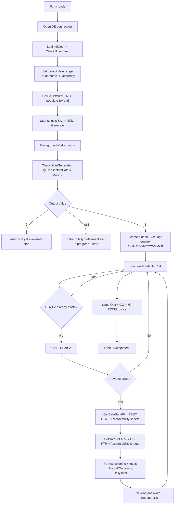
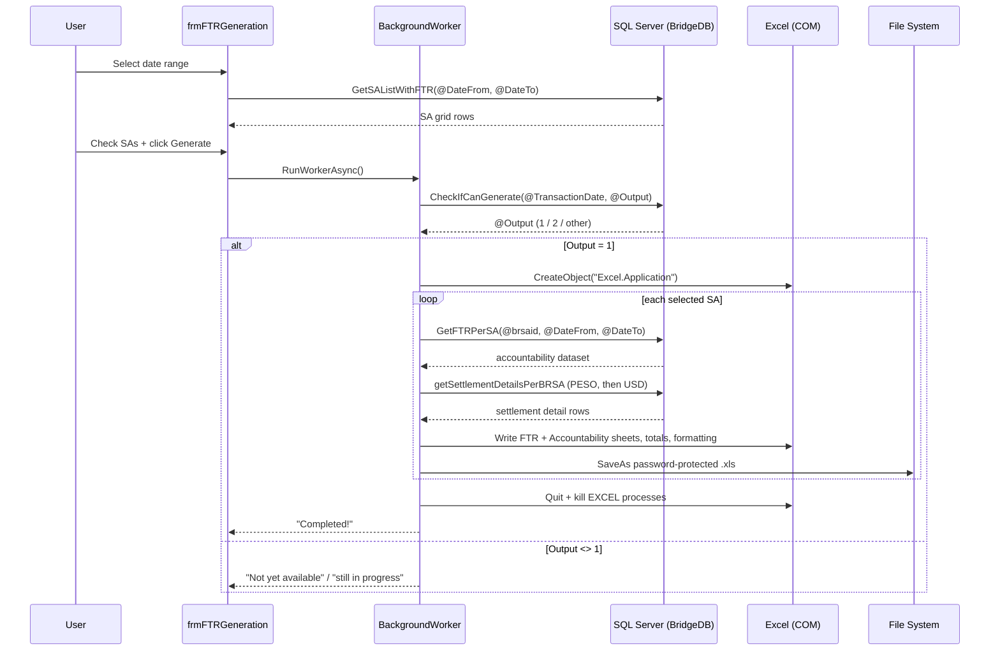

# FTR Generator

## What It Is

FTR Generator is a desktop application for Vantage Financial Corporation that generates **Final Transaction Reports (FTR)** — the daily settlement reports for sub-agents (SAs). These reports break down all money transfer transactions (inbound/outbound) in both Peso and USD, showing send amounts, charges, payouts, commissions, VAT, withholding tax, and documentary stamp tax.

The output is a password-protected Excel file (`.xls`) saved to `C:\SAReport\YYYY\MM\DD\` containing two worksheets per currency:
- **FTR sheet** — detailed daily settlement with per-transaction breakdown
- **Accountability Report sheet** — summarized accountability by sub-agent for the period

If generation is blocked, the app reports whether daily settlement is still in progress or the data is not yet available.

## Where It Lives

| What | Where |
|---|---|
| **Source repo** | [GitHub](https://github.com/vantagejoven/FTR-Generator) |
| **Production URL** | Desktop application — not web-deployed |
| **Server** | Ask IT Administrators |
| **Database(s)** | `BridgeDB` |

## Tech Stack

| Layer | Technology |
|---|---|
| **Language** | Visual Basic (.NET) |
| **Framework** | .NET Framework 4.0, Windows Forms |
| **Database** | SQL Server (ADO.NET — `System.Data.SqlClient`) |
| **Office Integration** | Excel COM Interop (late-bound) |
| **Concurrency** | `BackgroundWorker` (keeps the UI responsive during generation) |

## Architecture & Process Flow

### Project structure

The solution (`FTR GENERATION.sln`) contains a single Windows Forms project plus a Setup/installer project:

| File | Responsibility |
|---|---|
| **Module1.vb** | Global state — the shared SQL Server connection string, `SqlConnection`, and reusable command/adapter objects. This is where the DB connection is defined. |
| **LoginForm1.vb** | Modal login dialog. Authenticates via the `CheckIfUserExist` stored procedure and enforces a 90-day password-expiry check. |
| **frmFTRGeneration.vb** | The main form and the entire report-generation engine — SA grid loading, the generate gate, per-SA Excel building, totals, formatting, and file saving. |
| **Class1.vb** | Win32 helper (`WNetAddConnection2` / `WNetCancelConnection2`) for mapping/unmapping network drives. Utility code for network output paths. |
| **App.config** | Runtime target only (.NET 4.0 client profile). |

### Stored procedures

| Procedure | Purpose |
|---|---|
| `CheckIfUserExist` | Authenticates the login user; also returns password-change status/date |
| `GetSAListWithFTR` | Loads the grid of sub-agents that have FTR data for the selected date range |
| `CheckIfCanGenerate` | Gate check for the "to" date — returns `1` = ready, `2` = not yet available, else settlement still in progress |
| `GetFTRPerSA` | Returns the accountability dataset for one SA (drives the Accountability Report sheet) |
| `getSettlementDetailsPerBRSA` | Returns the per-transaction settlement detail rows for one SA + currency (drives the FTR sheet) |

### How a report is built

- **Currency passes:** for each selected SA, `GetDataSet` is called twice — once with `APZAPI = "API"` (**PESO**) and once with `APZAPI = "APZ"` (**USD**). Each pass adds an FTR sheet and an Accountability Report sheet to the workbook, so a full workbook can contain up to four sheets (`PESO-FTR`, `PESO-ACCOUNTABILITY REPORT`, `USD-FTR`, `USD-ACCOUNTABILITY REPORT`).
- **Inbound vs Outbound:** rows are grouped by `SendPayIndicator` (`"P"` = Inbound/Payout, otherwise Outbound/Send). `GroupTotal` and `DailyTotal` accumulate Send, Charge, Payout, Gross Commission, VAT, WTAX, and DST amounts and write the "Total Inbound" / "Total Outbound" and daily total blocks, with cell shading/borders applied via COM.
- **Group-specific column:** when `brsagroupid = "182"`, an extra **Net Commission** column is added to both sheets.
- **Default date range:** on load, "date from" is set to the 1st of the current month and "date to" to yesterday.
- **Idempotency:** if the target `.xls` for an SA + date range already exists, that SA is skipped (no overwrite).
- **Output:** each workbook is saved as a password-protected `.xls` (BIFF8, `FileFormat:=56`) using the SA's report password from the grid, to `C:\SAReport\YYYY\MM\DD\FTR-{SAName}-{DateFrom}-{DateTo}.xls`.
- **Excel lifecycle:** a hidden Excel COM instance is created for the run; afterward the app calls `Quit`, forces GC, and kills any lingering `EXCEL` processes to release COM objects.

### Generation flow

### Generation sequence

## Access

| What | How to Get It |
|---|---|
| **Server access** | Ask IT Administrators |
| **Database access** | Ask IT Administrators |
| **Application usage** | Authorized users with DB credentials |

> ⚠️ **Never store passwords or connection strings here.** Just say who to contact.

## Deployment

- **Method:** Manual — compile in Visual Studio and replace the executable on the target machine (a Setup/installer project is also included)
- **Pipeline:** None
- **Frequency:** On request, or when changes are made
- **Who deploys:** Developers

## Dependencies

| System / Service | How It Depends | What Breaks If It's Down |
|---|---|---|
| **BridgeDB (SQL Server)** | All transaction data, user authentication, and FTR data are queried from this database | The app cannot load SA lists, authenticate users, or generate reports |
| **Daily Settlement (EOD)** | Generation checks `CheckIfCanGenerate` — daily settlement must be complete before it proceeds | Reports cannot be generated; app shows "Daily Settlement is still in progress" |
| **Microsoft Excel (COM Interop)** | Excel must be installed on the machine — workbooks are built through a live Excel COM instance | Generation fails; no `.xls` files are produced |
| **Local/Network output path** | Files are written under `C:\SAReport\...`; `Class1.vb` can map network drives via Windows API for file output | Reports fail to save if the path is inaccessible or not writable |

## Who to Ask

| Team / Department | What They Know |
|---|---|
| **Developer Team** | Backend and database ownership, stored procedures (`GetSAListWithFTR`, `GetFTRPerSA`, `getSettlementDetailsPerBRSA`, `CheckIfCanGenerate`, `CheckIfUserExist`) |
| **Branch Operations** | Sub-agent (SA) maintenance |
| **Treasury Operations** | Settlement and reconciliation processes |

## Handover Notes

### Known Tech Debts

- **Hardcoded credentials in source.** The SQL Server connection string (including an `sa` account and plaintext password) is hardcoded in `Module1.vb` and committed to the repo. It should be moved to a config/secrets store and rotated, and the app should use a least-privilege account rather than `sa`.
- **Weak login enforcement.** In `LoginForm1.vb`, an invalid login only shows a `MsgBox` — the main form is still reachable. Authentication should hard-block on failure.
- **Excel COM Interop fragility.** Report building drives a live Excel instance and cleans up by force-killing all `EXCEL` processes on the machine. This can interfere with other open Excel sessions and is brittle; a non-COM export library (e.g. EPPlus/ClosedXML) would remove the Excel dependency entirely.
- **Suppressed error handling.** The main `Try/Catch` blocks are commented out, so failures surface as raw exceptions or partial output with no logging. There is no run log to diagnose failed generations.
- **Hardcoded output path & legacy format.** Output is fixed to `C:\SAReport\...` and saved only as legacy `.xls` (BIFF8). Both should be configurable, and a modern `.xlsx` format considered.
- **Magic values.** Currency passes use `"API"`/`"APZ"` for PESO/USD and a hardcoded `brsagroupid = "182"` toggles the Net Commission column — these are undocumented in code and easy to break.

---

*Last updated: July 2026*
