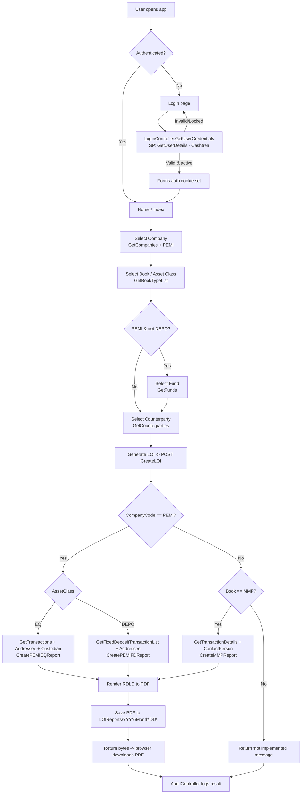
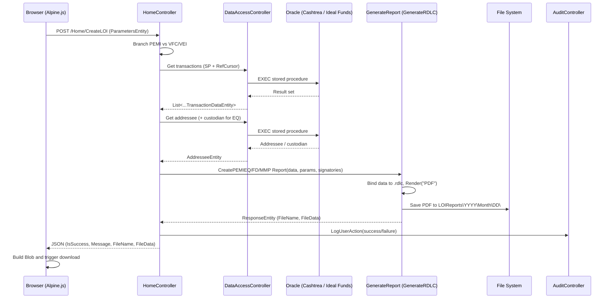
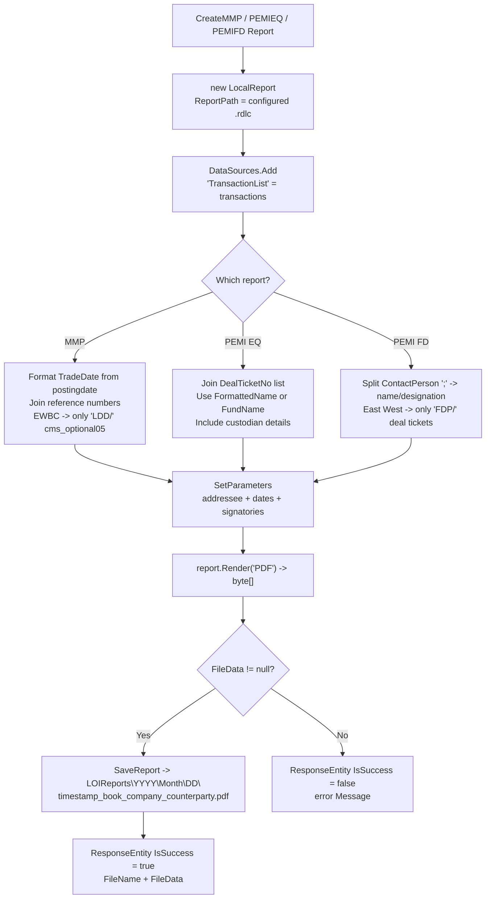

# LOI Generator

## What It Is

LOI Generator is a web application built to automate the creation of Letters of Intent (LOI) for the Treasury Operations team's daily transaction processing. It supports an 8-person department that handles a wide range of financial transactions — including foreign exchange, equities, fixed deposits, and other treasury instruments — by eliminating manual document preparation and reducing the risk of errors.

The output is a `.pdf` file containing the correct transaction amounts, settlement details, counterparty bank names, addressees, and authorized signatories. The system serves both Vantage Equities, Inc. and Philequity Management, Inc., ensuring that each entity's LOI adheres to its respective branding, signatory rules, and transaction workflows.

Under the hood it is a Visual Studio solution of three projects — an ASP.NET MVC web app, a shared entities library, and an RDLC report engine — that pulls transaction data from Oracle via stored procedures and renders it into a PDF through Microsoft ReportViewer (RDLC).

## Where It Lives

| What | Where |
|---|---|
| **Source repo** | [GitHub](https://github.com/vantage-vei/LOI-Generator) |
| **Production URL** | Ask IT Administrators |
| **Server** | Ask IT Administrators |
| **Database(s)** | `Ideal Funds`, `Cashtrea` |

## Tech Stack

| Layer | Technology |
|---|---|
| **Language** | C#, JavaScript |
| **Framework** | .NET Framework 4.7, ASP.NET MVC 5 |
| **Frontend** | Alpine.js, Bootstrap, jQuery, SweetAlert2, waitMe |
| **Database** | Oracle SQL (ODP.NET — `Oracle.ManagedDataAccess`) |
| **Reports** | RDLC via Microsoft ReportViewer (WebForms), rendered to PDF |
| **Auth** | ASP.NET Forms Authentication |

## Architecture & Process Flow

### Solution structure

The `Codes` folder contains three projects:

| Project | Responsibility |
|---|---|
| **WebApplication1** | The MVC web application — controllers, Razor views, and the Alpine.js frontend. This is the entry point. |
| **RDLCEntities** | Shared POCO/DTO classes (`ParametersEntity`, `TransactionDataEntity`, `PEMITransactionDataEntity`, `AddresseeEntity`, `ResponseEntity`, `ApiResponse<T>`, etc.) used across the web app and the report engine. |
| **GenerateRDLC** | The report engine (`GenerateReport.cs`). Takes the fetched data, binds it to the correct `.rdlc` template, renders a PDF, and saves it to disk. |

### Controllers

| Controller | Role |
|---|---|
| **LoginController** | Authenticates the user against the `GetUserDetails` stored procedure (Cashtrea DB) and issues a Forms Authentication cookie. Also blocks locked accounts. |
| **HomeController** | Orchestrates the whole flow: serves the dropdown data (`GetCompanies`, `GetBookTypeList`, `GetFunds`, `GetCounterparties`) and handles `CreateLOI`, branching between PEMI and VFC/VEI logic. Pulls signatories from `Web.config`. |
| **DataAccessController** | All Oracle data access. Each method opens a connection, calls a stored procedure with a `RefCursor` output, and maps the reader into entities. Also holds `ParseCustomData`. |
| **AuditController** | Writes user events (login, logout, generation success/failure) to the `LOIGeneratorAudit` table via `InsertAuditEvent`. |

### Two databases, two paths

The system routes to a different Oracle database and a different set of stored procedures depending on the selected company:

- **PEMI** (Philequity) → `IdealDb` (Ideal Funds). Sub-paths by asset class:
  - **EQ** (equities) → `GetTransactions` + `GetPEMIAddressee` + `GetCustodianDetails` → `CreatePEMIEQReport` → `LOI - PEMI EQ - Landscape.rdlc`
  - **DEPO** (fixed deposit) → `GetFixedDepositTransactionList` + `GetPEMIAddressee` → `CreatePEMIFDReport` → `LOI - PEMI FD.rdlc`
- **VFC / VEI / EBIZ** → `CashtreaDb` (Cashtrea). Currently only the **MMP** book is implemented:
  - **MMP** → `GetTransactionDetails` + `GetContactPersonDetails` → `CreateMMPReport` → `LOI - MMP.rdlc`

Any other asset class / book returns a "not yet implemented in this system" message rather than a PDF.

### Notable data-handling details

- **Cashtrea data parsing:** `GetTransactionDetails` returns three delimited strings per transaction (`text_data`, `num_data`, `date_data`) in a `key=value;` format. `DataAccessController.ParseCustomData` concatenates them and uses **reflection** to set matching properties on `TransactionDataEntity` — so property names must exactly match the DB column keys (which is why they are intentionally lowercase, not PascalCase).
- **Reference-number special cases** (`GenerateReport.cs`): for EWBC counterparties (MMP) only `cms_optional05` values starting with `LDD/` are joined; for East West fixed-deposit counterparties only deal tickets starting with `FDP/` are joined.
- **Signatories** are not stored in the DB — they are read from `Web.config` app settings and differ for PEMI vs VFC/VEI.
- **Saved output:** every generated PDF is written to `ReportPath\YYYY\Month\DD\` with a timestamped filename (`{timestamp}_{book}_{company}_{counterparty}.pdf`) and also streamed back to the browser for download.

### End-to-end flow

### `CreateLOI` sequence

### Inside GenerateRDLC (report engine)

The three `Create*Report` methods in `GenerateReport.cs` share the same pattern — the differences are which `.rdlc` template is loaded, which report parameters are set, and the counterparty-specific reference-number rules. `SaveReport` is the shared step that persists the PDF.

## Access

| What | How to Get It |
|---|---|
| **Server access** | Ask IT Administrators |
| **Database access** | Ask IT Administrators |
| **Application usage** | Same credentials users use in logging in on Cashtrea app |

> ⚠️ **Never store passwords or connection strings here.** Just say who to contact.

## Deployment

- **Method:** Manual — compile in Visual Studio and replace the executable on the target machine
- **Pipeline:** None
- **Frequency:** On request, or when changes are made
- **Who deploys:** Developers

## Dependencies

| System / Service | How It Depends | What Breaks If It's Down |
|---|---|---|
| **Ideal Funds** | PEMI's transaction data for the mutual funds | The app cannot produce Letter of Intent for PEMI's transactions |
| **Cashtrea** | VEI's transaction data, plus user authentication and audit logging | The app cannot produce LOI for VEI's transactions, and no one can log in |
| **RDLC templates** | The `.rdlc` files in `GenerateRDLC\Reports` are the layout for each PDF; their paths are configured in `Web.config` | Report generation fails if the configured template path is missing on the server |
| **Report output directory** | Generated PDFs are saved under the `ReportPath` folder (`...\LOIReports\YYYY\Month\DD\`) | Generation fails if the path is inaccessible or not writable |

## Who to Ask

| Team / Department | What They Know |
|---|---|
| **Developer Team** | Backend and database ownership |
| **Treasury Operations** | Daily process |

## Handover Notes

### Known Tech Debts

- **Secrets in source control.** Oracle connection strings (including usernames and passwords) are stored in plaintext in `Web.config` and committed to the repo. They currently point to a UAT environment. These should be moved out of source control (e.g. environment-specific config transforms or a secrets store) before/for production.
- **Hardcoded absolute RDLC paths.** The `PEMIEQReportPath`, `PEMIFDReportPath`, and `MMPReportPath` app settings point to absolute developer paths (e.g. `D:\Work Files\...`). These must be edited per server/machine or generation will fail — they should be made relative to the app root.
- **Partial VFC/VEI coverage.** Only the **MMP** book is implemented for VFC/VEI; any other book returns a "not yet implemented" message. New books require new stored procedures, RDLC templates, and a branch in `HomeController`.
- **Reflection-based parsing is fragile.** Cashtrea transaction parsing (`ParseCustomData`) relies on `TransactionDataEntity` property names matching the DB column keys exactly. Renaming a property silently drops that value from the PDF.

---

*Last updated: July 2026*
