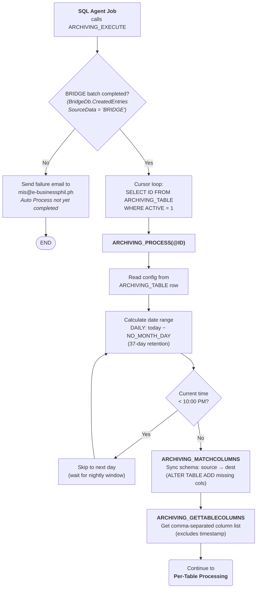
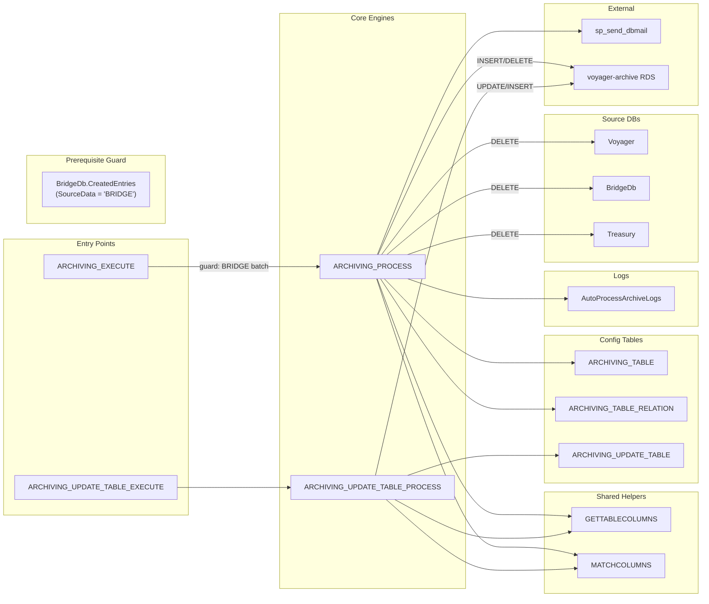

# eSettlement / Voyager Archiving Configuration

> This documents the actual archiving configuration found in the eSettlement `[Archive Database]` (production). The operation pattern documented here is stable — individual table configurations may change but the mechanism is consistent.
>
> For the shared architecture, stored procedures, key behaviors, and how-to guide, see the [Production Archiving overview](./production-archiving.md).

## Overview

- **Source:** `Voyager`, `BridgeDb`, and `Treasury` databases (production)
- **Destination:** `[voyager-archive.chs97qkefxud.ap-southeast-1.rds.amazonaws.com].<Catalog>` (AWS RDS, Singapore), where `<Catalog>` mirrors the source — `Voyager`, `BridgeDB`, or `Treasury`
- **Retention:** 37 days for all transactional tables
- **Schedule:** All jobs run `DAILY`, typically **after 10:00 PM** Philippine time
- **Prerequisite:** The `BridgeDb.dbo.CreatedEntries` table must have a row where `[SourceData] = 'BRIDGE'` for the calculated transaction date (today − retention days) — the BridgeDb batch must complete before archiving runs
- **Notifications:** Emails sent via `msdb.dbo.sp_send_dbmail` (profile: `esettlement`) to `BSS@e-businessphil.ph`; prerequisite failures go to `mis@e-businessphil.ph` (CC: `itadmin@e-businessphil.ph`)

---

## ARCHIVING_TABLE — Transactional Archiving Jobs

Each row defines one source table to be archived. All are `ACTIVE = 1`, `RUN_SCHEDULED = DAILY`, `SOURCE_DELETE = 1`.

### How the 37-Day Retention Works

For a `DAILY` schedule with `NO_MONTH_DAY = 37`, the stored procedure processes data that is exactly 37 days old. In effect, the source keeps the last 37 days of data, and everything older is moved to the archive. The process catches up one day at a time from the last processed date.

### Configured Tables

| ID | Source DB | Source Table | Date Column | Relation (Child Tables) | Status |
|---|---|---|---|---|---|
| 1 | Voyager | `[txnEntry]` | `[RepDate]` | amtLog, txnTemplate (via `ID`) | **Stuck** — duplicate key violation |
| 2 | Voyager | `[AMLA]` | `[RepDate]` | None | OK |
| 3 | BridgeDb | `[txnEntry]` | `[Repdate]` | None | OK |
| 4 | BridgeDb | `[txnProcessed]` | `[repdate]` | None | OK |
| 5 | BridgeDb | `[Daily Settlement]` | `[Transaction Date]` | None | OK |
| 6 | BridgeDb | `[ARAP Daily]` | `[Transaction Date]` | None | OK |
| 7 | BridgeDb | `[JournalVoucherNEW]` | `[TransactionDate]` | None | OK |
| 8 | BridgeDb | `[RFP]` | `[SettlementDate]` | RFPDetails, RFPFC (via `RFPID`) | No data found |
| 9 | BridgeDb | `[OffSetNew]` | `[TrxnDate]` | None | No data found |
| 10 | BridgeDb | `[PDSRate]` | `[TransactionDate]` | None | OK |
| 11 | BridgeDb | `[RFPLOIDetails]` | `[SA_TransactionDueDate]` | None | No data found |
| 12 | Treasury | `[Settlement]` | `[RepDate]` | None | OK |

### Known Issue: txnEntry (ID 1) Stuck

The `Voyager.dbo.txnEntry` archiving (ID 1) has been stuck at `PROCESSED_LASTDATE = 2024-10-01` due to a unique key constraint violation on `IdX_txnEntry_Unique`. The duplicate key error prevents the INSERT into the archive destination, causing the procedure to fail and not advance. The other 11 tables continue archiving normally up to `2026-05-31`.

---

## ARCHIVING_TABLE_RELATION — Parent-Child Relationships

When a parent row is archived, matching child rows are archived together to maintain referential integrity. The process inserts child rows via an `INNER JOIN` on the parent table, then deletes the child rows from the source.

| Relation ID | Child Table | Source DB | Join Key | Parent Table (ID) |
|---|---|---|---|---|
| 1 | `amtLog` | Voyager | `Entry_ID` | txnEntry (ID 1) |
| 1 | `txnTemplate` | Voyager | `Entry_ID` | txnEntry (ID 1) |
| 8 | `RFPDetails` | BridgeDb | `RFPID` | RFP (ID 8) |
| 8 | `RFPFC` | BridgeDb | `RFPID` | RFP (ID 8) |

---

## ARCHIVING_UPDATE_TABLE — Reference Data Syncing

These tables are **synced** (copied or updated) to the archive server but **never deleted** from the source. They provide reference/lookup data the archive destination needs locally. All 21 configured tables use `ACTION = 3` (Update + Insert).

### Configured Tables

#### From Voyager

| ID | Table | Key Field |
|---|---|---|
| 1 | `[nacAccount]` | `Number` |
| 2 | `[nacLocation]` | `ID` |
| 3 | `[EmailAddressesNotification]` | `ID` |
| 4 | `[txnExplanation]` | `ID` |
| 5 | `[txnCountry]` | `ID` |

#### From BridgeDb

| ID | Table | Key Field |
|---|---|---|
| 6 | `[brsaAccount]` | `brsaaccountid` |
| 7 | `[CompanyBank]` | `ID` |
| 8 | `[Holiday]` | `ID` |
| 9 | `[brsaCluster]` | `ClusterID` |
| 10 | `[brsaComm]` | `brsaComm` |
| 11 | `[BrSACompany]` | `CompanyID` |
| 12 | `[brsaDetail]` | `brsaid` |
| 13 | `[brsaGroup]` | `GroupID` |
| 14 | `[brsaGroupOfGroup]` | `Code` |
| 15 | `[brsaLocation]` | `LocationID` |
| 16 | `[brsaNAVTableMap]` | `brsaID` |
| 17 | `[brsaSettlementGroup]` | `SettlementGroupCode` |
| 18 | `[brsaTerminal]` | `TerminalID` |
| 19 | `[EmailAddressesNotification]` | `ID` |
| 20 | `[Users]` | `username` |
| 21 | `[brsaBankDetail]` | `brsaid` |

---

## eSettlement-Specific Behaviors

### Multi-Source Architecture

Unlike eTerminal archiving (single source: `Navision`), eSettlement archiving spans **three source databases**: `Voyager`, `BridgeDb`, and `Treasury`. Each source maps to a corresponding database on the destination RDS. The same stored procedures handle all three — the source is determined per-row by `SOURCE_TABLE_CATALOG`.

### Special Case: txnProcessed (ID 4)

`BridgeDb.dbo.txnProcessed` uses a different date comparison pattern from all other tables. While normal tables compare dates via `CONVERT(VARCHAR(10), date_column, 112)`, ID 4 uses raw integer equality (`date_column = @date`). This is a hardcoded exception inside `ARCHIVING_PROCESS`.

### Cross-Database Collation

`ARCHIVING_UPDATE_TABLE_PROCESS` uses `COLLATE DATABASE_DEFAULT` on key comparisons when joining source and destination rows. This is needed because source databases (`Voyager`, `BridgeDb`, `Treasury`) have different collations from the archive destination (`voyager-archive` RDS).

---

## Process Flow Diagrams

### 1. Gate & Setup — ARCHIVING_EXECUTE Entry Point

### 2. Procedure Call Hierarchy

---

*Last updated: July 2026*
