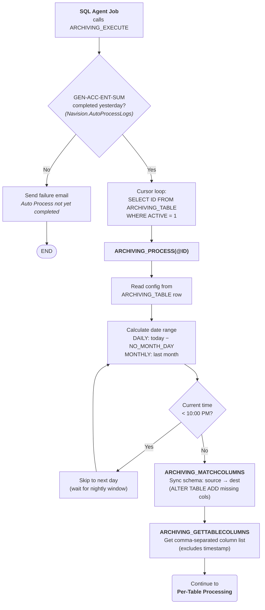
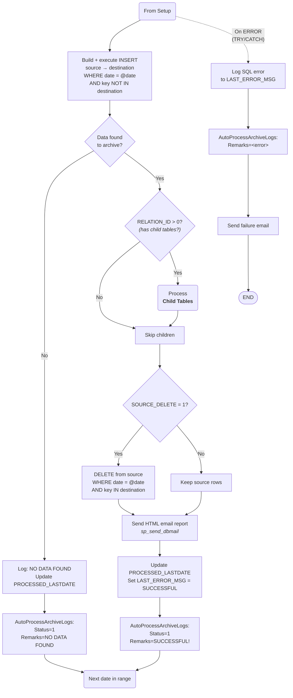
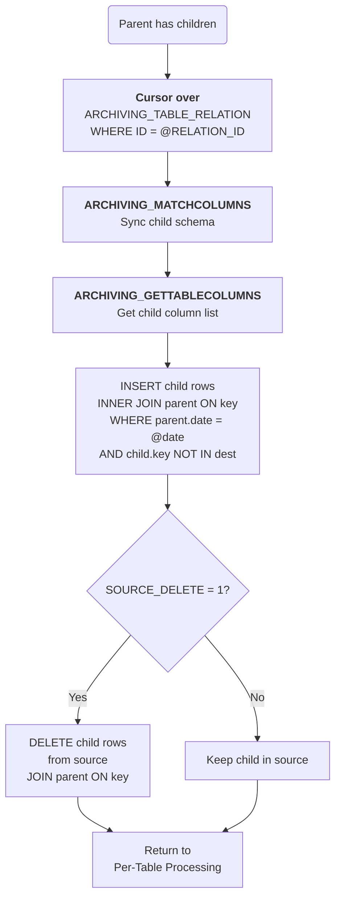
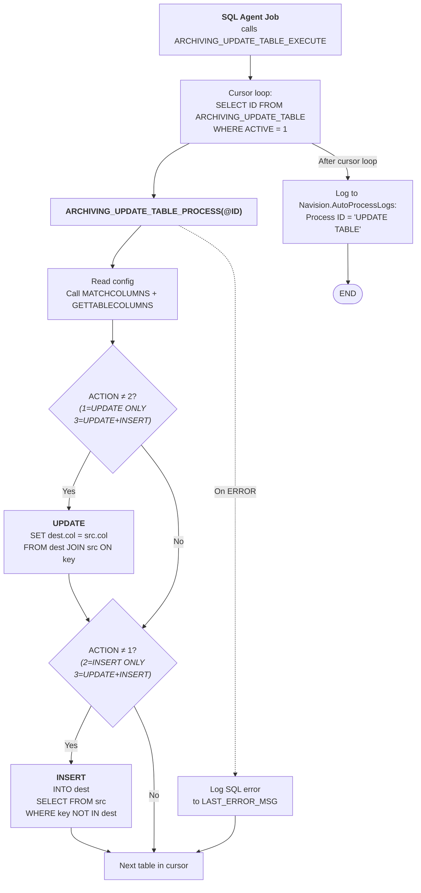
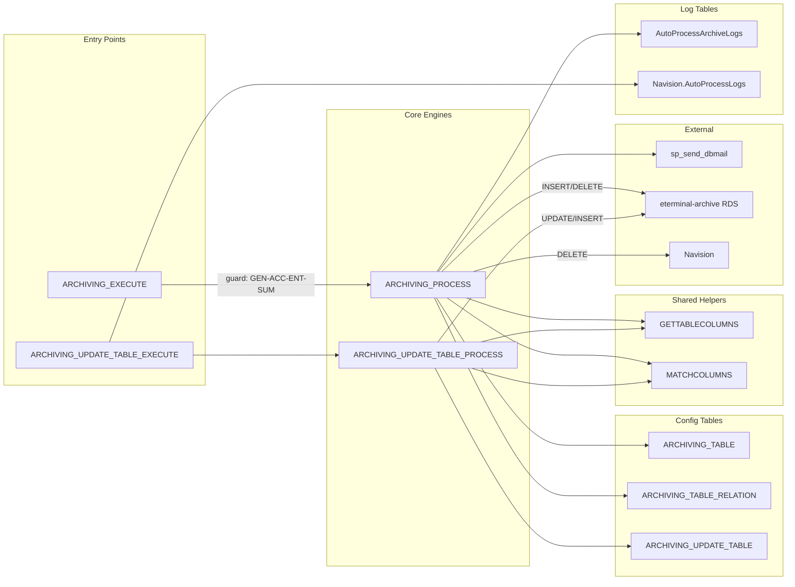

# eTerminal Archiving Configuration

> This documents the actual archiving configuration found in the eTerminal `[Archive Database]` (production). The operation pattern documented here is stable — individual table configurations may change but the mechanism is consistent.

## Overview

- **Source:** `Navision` database (production)
- **Destination:** `[eterminal-archive.chs97qkefxud.ap-southeast-1.rds.amazonaws.com].Navision` (AWS RDS, Singapore)
- **Retention:** 7 days for all transactional tables
- **Schedule:** All jobs run `DAILY`, typically **after 10:00 PM** Philippine time
- **Prerequisite:** The `Navision.dbo.AutoProcessLogs` table must have a `'GEN-ACC-ENT-SUM'` entry for yesterday — the accounting batch must complete before archiving runs
- **Notifications:** Emails sent via `msdb.dbo.sp_send_dbmail` (profile: `eTerminal`) to `BSS@e-businessphil.ph` with CC to `itadmin@e-businessphil.ph`

---

## ARCHIVING_TABLE — Transactional Archiving Jobs

Each row defines one source table to be archived. All are `ACTIVE = 1`, `RUN_SCHEDULED = DAILY`.

### How the 7-Day Retention Works

For a `DAILY` schedule with `NO_MONTH_DAY = 7`, the stored procedure processes data that is exactly 7 days old. In effect, the source keeps the last 7 days of data, and everything older is moved to the archive. The process catches up one day at a time from the last processed date.

### Known Configured Tables (IDs 1-10)

| ID | Source Table | Date Column | Relation (Child Table) |
|---|---|---|---|
| 1 | `[E-Business Services Inc_$Branch Journal Line]` | `[Posting Date]` | MoneySerialNumber (via `[Document No_]`) |
| 2 | `[Expenses and Utilities]` | `[Posting Date]` | None |
| 3 | `[Miscellaneous]` | `[Transaction Date]` | None |
| 4 | `[Fund Transfer]` | `[Transfer Date]` | None |
| 5 | `[E-Business Services Inc_$AR Topsheet]` | `[TopSheet Date]` | None |
| 6 | `[E-Business Services Inc_$AR Main Vault]` | `[ARMV Date]` | None |
| 7 | `[E-Business Services Inc_$AR Topsheet to Main Vault]` | `[TopSheet Date]` | None |
| 8 | `[OR]` | `[Transaction Date]` | OR_Details (via `[OR Number]`) |
| 9 | `[OR_Registered]` | `[Transaction Date]` | None |
| 10 | `[CPR Journal Entry]` | `[Transaction Date]` | None |

There are 12 more configured tables beyond ID 10 (22 total). All follow the same pattern.

### Source Delete Behavior

- **19 tables** have `SOURCE_DELETE = 1` — rows are deleted from `Navision` production after successful archiving
- **3 tables** have `SOURCE_DELETE = 0` — rows are copied to archive but **kept** in production (these are likely tables shared with other systems or needed for longer-term reporting)

---

## ARCHIVING_TABLE_RELATION — Parent-Child Relationships

When a parent row is archived, matching child rows are archived together to maintain referential integrity. The process inserts child rows via an `INNER JOIN` on the parent table, then deletes the child rows from the source.

| ID | Child Table | Join Key | Parent(s) |
|---|---|---|---|
| 1 | `MoneySerialNumber` | `[Document No_]` | Branch Journal Line (ID 1) |
| 2 | `OR_Details` | `[OR Number]` | OR (ID 8) |
| 3 | `LOISeriesDetails` | `Series` | (table not shown in sample) |

**Example:** When `[OR]` rows are archived, the procedure also copies and deletes matching `OR_Details` rows via `[OR Number]`.

---

## ARCHIVING_UPDATE_TABLE — Reference Data Syncing

These tables are **synced** (copied or updated) to the archive server but **never deleted** from the source. They provide reference/lookup data the archive destination needs locally.

### Action Codes

| Code | Behavior | Use Case |
|---|---|---|
| `2` | **Copy (Insert only)** | Full table copy of new rows, like logs or upload series |
| `3` | **Update + Insert** | Incremental sync for reference tables that change (employees, clusters, dimensions) |

### Configured Tables (IDs 1-10)

| ID | Table | Action | Key Field | Notes |
|---|---|---|---|---|
| 1 | `[E-Business Services Inc_$Employee]` | Update+Insert (3) | `No_` | |
| 2 | `[Cash Advance]` | Insert (2) | `ID` | |
| 3 | `CDDUploadSeries` | Insert (2) | `Series` | |
| 4 | `CurrencyExchangeRate` | Insert (2) | `ID` | |
| 5 | `CustomerTransactionLogs` | Insert (2) | `ID` | |
| 6 | `Cluster` | Update+Insert (3) | `ID` | |
| 7 | `[Cluster Branch]` | Update+Insert (3) | `ID` | |
| 8 | `EmailAddressesNotification` | Update+Insert (3) | `ID` | |
| 9 | `[E-Business Services Inc_$Dimension Value]` | Update+Insert (3) | `Code` | Extra join: `[Dimension Code] = A.[Dimension Code]` |
| 10 | `[eTerminal]` | Update+Insert (3) | `eTerminalID` | |

There is 1 more configured table beyond ID 10 (11 total).

---

## Stored Procedures

All reside in the `[Archive Database]` on the production server.

| Procedure | Role |
|---|---|
| `ARCHIVING_EXECUTE` | Entry point for transactional archiving. Checks prerequisite (GEN-ACC-ENT-SUM completed), then loops all active `ARCHIVING_TABLE` rows |
| `ARCHIVING_PROCESS` | Core engine. Builds and executes dynamic INSERT/DELETE SQL for one table + its children, sends email report, logs to `AutoProcessArchiveLogs` |
| `ARCHIVING_GETTABLECOLUMNS` | Helper. Returns comma-separated column list of a table (excludes `timestamp`) for building INSERT column lists |
| `ARCHIVING_MATCHCOLUMNS` | Helper. Compares source/destination schemas and ALTER TABLE ADD missing columns on destination |
| `ARCHIVING_UPDATE_TABLE_EXECUTE` | Entry point for reference data sync. Loops all active `ARCHIVING_UPDATE_TABLE` rows |
| `ARCHIVING_UPDATE_TABLE_PROCESS` | Syncs one reference table. Performs UPDATE (if ACTION=1 or 3) and INSERT (if ACTION=2 or 3) based on `RELATION_FIELD` |

---

## Process Flow Diagrams

### 1. Gate & Setup — ARCHIVING_EXECUTE Entry Point

### 2. Per-Table Processing — Main INSERT & DELETE Cycle

### 3. Child Table Cascade — ARCHIVING_TABLE_RELATION

### 4. Reference Data Sync — ARCHIVING_UPDATE_TABLE

### 5. Procedure Call Hierarchy

---

## Key Behaviors

### 10:00 PM Time Gate
The archiving procedure checks if the current time is before 10:00 PM. If the day to process is today and it's before 10 PM, archiving skips that day — it waits until the nightly window. This prevents archiving from interfering with daytime operations.

### Schema Auto-Sync
`ARCHIVING_MATCHCOLUMNS` runs before every archive/sync operation. If new columns have been added to a source table, they are automatically added to the destination table with the correct data type. This means schema changes are propagated without manual intervention.

### Deduplication
Destination inserts use a `NOT IN (SELECT ... FROM destination)` pattern based on `RELATION_FIELD` to avoid inserting rows that already exist in the archive.

### No Foreign Keys
There are no SQL `FOREIGN KEY` constraints between the configuration tables. Relationships are enforced entirely in the stored procedure logic via `RELATION_ID` and `RELATION_FIELD`.

### Linked Server
The destination is reached via SQL Server linked server. The current endpoint is the `eterminal-archive` RDS instance. Historically (pre-2019), the destination was an IP-based server (`13.228.233.96`) which was replaced by the RDS endpoint.

---

## Adding a New Table to Archive

To add a new table to the archiving process:

1. **Create matching table** on the destination `eterminal-archive` server (or let `ARCHIVING_MATCHCOLUMNS` auto-create columns on first run)
2. **INSERT a row** into `ARCHIVING_TABLE` with:
   - Source/destination catalog, schema, and table names
   - The date column to filter by (`TABLE_DATE`)
   - `RELATION_ID = 0` (or a valid relation ID if it has children)
   - `RELATION_FIELD` = any unique column (used for deduplication)
   - `NO_MONTH_DAY = 7`
   - `EMAIL_TO` and `EMAIL_CC`
   - `ACTIVE = 1`
   - `RUN_SCHEDULED = 'DAILY'`
   - `SOURCE_DELETE = 1` (or `0` to keep source rows)
3. If the table has child tables that must be archived together, add rows to `ARCHIVING_TABLE_RELATION`

*Last updated: July 2026*
