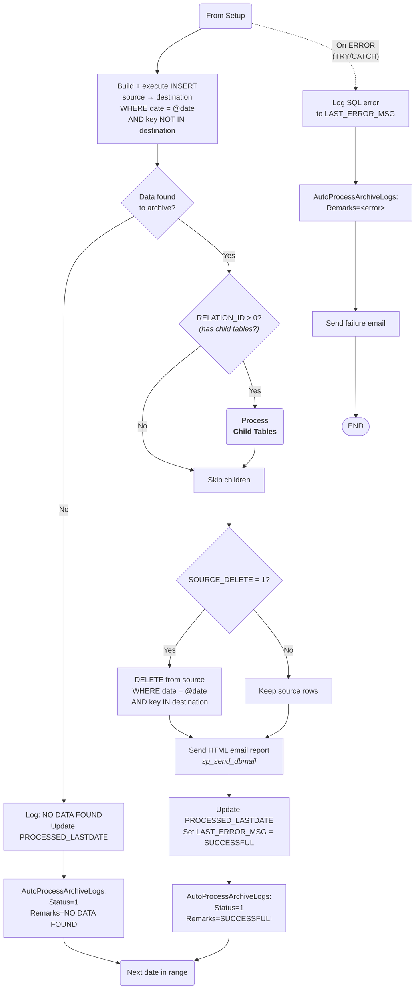
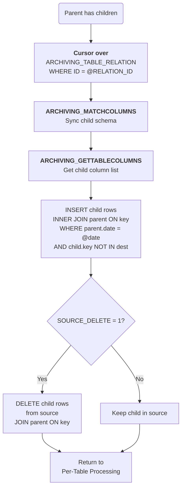
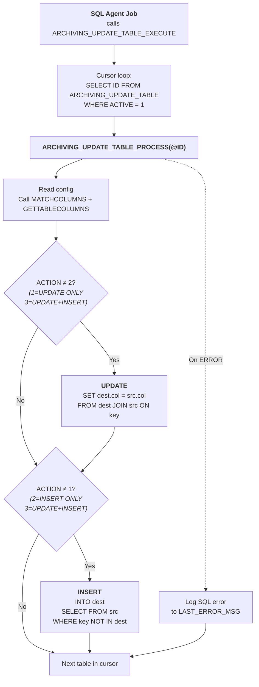

# Production Archiving

## What It Is

Production Archiving is a set of **SQL Server Agent jobs** that automatically transfer transaction-relevant data from production databases into dedicated archive databases on separate archive servers. This prevents the production databases from accumulating historical data beyond their configured retention periods.

There are two separate archiving environments:

| Archive Environment | Source Systems | Retention Period | Archive Server |
|---|---|---|---|
| **eTerminal Archive** | Navision (eTerminal) | **7 days** | eTerminal's dedicated archive server (`eterminal-archive` RDS) |
| **eSettlement / Voyager Archive** | Voyager, BridgeDb, Treasury | **37 days** | Voyager server's archive environment |

Only **transaction-relevant tables** are included via `ARCHIVING_TABLE`. Reference/lookup tables (employees, clusters, exchange rates, etc.) are synced separately via `ARCHIVING_UPDATE_TABLE` — copied/updated to the archive but **never deleted** from the source.

---

## Comparison: eTerminal vs eSettlement

| Aspect | eTerminal | eSettlement / Voyager |
|---|---|---|
| **Source DB(s)** | `Navision` | `Voyager`, `BridgeDb`, `Treasury` |
| **Destination** | `eterminal-archive` RDS | `voyager-archive` RDS |
| **Retention** | 7 days | 37 days |
| **Transactional tables** | 22 | 12 |
| **Reference tables** | 11 | 21 |
| **Source delete** | 19 of 22 = `1` | 12 of 12 = `1` |
| **Prerequisite** | `Navision.dbo.AutoProcessLogs` — `GEN-ACC-ENT-SUM` | `BridgeDb.dbo.CreatedEntries` — `SourceData = 'BRIDGE'` |
| **Email profile** | `eTerminal` | `esettlement` |
| **Prerequisite-failure email** | Uses per-table `EMAIL_TO` | Hardcoded to `mis@e-businessphil.ph` (CC: `itadmin@e-businessphil.ph`) |
| **UPDATE_TABLE post-loop log** | Logs to `Navision.AutoProcessLogs` (Process ID `'UPDATE TABLE'`) | No logging |
| **Cross-DB key matching** | Not used | `COLLATE DATABASE_DEFAULT` |

---

## How It Works

Two SQL Server Agent jobs run the archiving:

| Agent Job | Calls | What It Does |
|---|---|---|
| **Transactional Archiving** | `ARCHIVING_EXECUTE` | Copies transaction data to archive, then deletes from source |
| **Reference Data Sync** | `ARCHIVING_UPDATE_TABLE_EXECUTE` | Copies/updates reference tables to archive (no deletion) |

### Transactional Archiving Flow

1. **`ARCHIVING_EXECUTE`** — Entry point. Checks an environment-specific prerequisite before proceeding (see comparison table above). If the prerequisite passes, it loops through all active `ARCHIVING_TABLE` rows and calls `ARCHIVING_PROCESS` for each.

2. **`ARCHIVING_PROCESS`** — The core engine for one table. For each row:
   - **Determines date range**: For `DAILY` schedule, processes data exactly `NO_MONTH_DAY` days old (i.e., keep N days of recent data, archive everything older). Catches up from `PROCESSED_LASTDATE` one day at a time.
   - **10 PM time gate**: If the day to process is today and current time < 10:00 PM, it skips and waits for the next run.
   - **Schema sync**: Calls `ARCHIVING_MATCHCOLUMNS` to ensure the destination table has all source columns (adds missing columns via `ALTER TABLE`).
   - **Insert to archive**: Builds and executes `INSERT INTO destination ... SELECT ... FROM source` for the date being processed, skipping rows already in destination (based on `RELATION_FIELD`).
   - **Cascade to children**: If `RELATION_ID > 0`, iterates through `ARCHIVING_TABLE_RELATION` child tables and inserts matching child rows using an `INNER JOIN` on the parent.
   - **Delete from source**: If `SOURCE_DELETE = 1`, deletes the archived row from the source table (only if it was successfully inserted to destination).
   - **Sends email report**: HTML email via `msdb.dbo.sp_send_dbmail` with insert/delete counts for main and child tables.
   - **Logs to `AutoProcessArchiveLogs`**: Records `ProcessID`, timestamps, and result.
   - **Error handling**: On failure, logs the SQL error, sends a failure email, and continues to the next table.

3. **`ARCHIVING_GETTABLECOLUMNS`** — Helper. Returns a comma-separated list of a table's columns (excluding `timestamp`), used to build dynamic `INSERT` column lists.

4. **`ARCHIVING_MATCHCOLUMNS`** — Helper. Compares source and destination table schemas. If columns exist in the source but not the destination, it `ALTER TABLE ADD` the missing column on the destination with the correct data type (handles `nvarchar`, `decimal`, and other types).

### Reference Data Sync Flow

5. **`ARCHIVING_UPDATE_TABLE_EXECUTE`** — Entry point. Loops through all active `ARCHIVING_UPDATE_TABLE` rows and calls `ARCHIVING_UPDATE_TABLE_PROCESS` for each. In eTerminal, logs completion to `Navision.dbo.AutoProcessLogs` with process ID `'UPDATE TABLE'`; in eSettlement, no post-loop logging.

6. **`ARCHIVING_UPDATE_TABLE_PROCESS`** — Syncs one reference table:
   - **Schema sync**: Calls `ARCHIVING_MATCHCOLUMNS` to add any missing columns.
   - **UPDATE** (if `ACTION = 1` or `3`): Updates existing rows in destination by joining on `RELATION_FIELD` and updating all non-key columns.
   - **INSERT** (if `ACTION = 2` or `3`): Inserts rows from source that don't exist in destination based on `RELATION_FIELD`.
   - Source data is **never deleted**.

### Action Codes (ARCHIVING_UPDATE_TABLE)

| Code | Behavior |
|---|---|
| `1` | Update only — sync existing rows |
| `2` | Insert only — copy new rows |
| `3` | Update + Insert — full sync (most common for reference tables) |

---

## Stored Procedures

The same procedure names exist in both archive environments, but the **implementations differ** — each has its own prerequisite check, email profile, and logging behavior. The helpers (`GETTABLECOLUMNS`, `MATCHCOLUMNS`, `Split`) are identical across both.

| Procedure | Role |
|---|---|
| `ARCHIVING_EXECUTE` | Entry point for transactional archiving. Checks prerequisite, then loops all active `ARCHIVING_TABLE` rows. |
| `ARCHIVING_PROCESS` | Core engine. Builds and executes dynamic INSERT/DELETE SQL for one table + its children, sends email report, logs to `AutoProcessArchiveLogs`. |
| `ARCHIVING_GETTABLECOLUMNS` | Helper. Returns comma-separated column list (excludes `timestamp`) for building INSERT column lists. |
| `ARCHIVING_MATCHCOLUMNS` | Helper. Compares source/destination schemas and ALTER TABLE ADD missing columns on destination. |
| `ARCHIVING_UPDATE_TABLE_EXECUTE` | Entry point for reference data sync. Loops all active `ARCHIVING_UPDATE_TABLE` rows. |
| `ARCHIVING_UPDATE_TABLE_PROCESS` | Syncs one reference table. Performs UPDATE and/or INSERT based on `RELATION_FIELD`. |
| `Split` | Helper function for parsing comma-separated strings (used for building UPDATE column lists). |

---

## Key Tables in the `[Archive Database]`

### ARCHIVING_TABLE

**Main archiving configuration.** Each row defines one source table to be archived.

| Column | Type | Description |
|---|---|---|
| `ID` | `int` | Primary identifier |
| `SOURCE_TABLE_CATALOG` | `nvarchar(255)` | Source database name (e.g. `Navision`, `Voyager`) |
| `SOURCE_TABLE_SCHEMA` | `nvarchar(255)` | Source schema (e.g. `dbo`) |
| `SOURCE_TABLE_NAME` | `nvarchar(255)` | Source table name |
| `DESTINATION_TABLE_CATALOG` | `nvarchar(255)` | Destination database (linked server + database) |
| `DESTINATION_TABLE_SCHEMA` | `nvarchar(255)` | Destination schema |
| `DESTINATION_TABLE_NAME` | `nvarchar(255)` | Destination table name |
| `TABLE_DATE` | `nvarchar(255)` | Date column used to determine which rows to archive |
| `RELATION_ID` | `int` | Foreign key to `ARCHIVING_TABLE_RELATION.ID` (`0` = no relation) |
| `RELATION_FIELD` | `nvarchar(255)` | Column used to match parent and child rows, and for deduplication |
| `NO_MONTH_DAY` | `int` | Retention period in **days** |
| `EMAIL_TO` | `nvarchar(255)` | Primary email notification recipient |
| `EMAIL_CC` | `nvarchar(255)` | CC email notification recipient |
| `ACTIVE` | `int` | `1` = active, `0` = inactive |
| `LAST_RUN` | `datetime` | Timestamp of last run (operational) |
| `LAST_ERROR_MSG` | `nvarchar(MAX)` | Outcome of last run (operational) |
| `PROCESSED_LASTDATE` | `datetime` | Date up to which data has been archived (catch-up marker) |
| `RUN_SCHEDULED` | `nvarchar(50)` | Schedule: `DAILY` or `MONTHLY` |
| `SOURCE_DELETE` | `int` | `1` = delete rows from source after archiving, `0` = keep |

### ARCHIVING_TABLE_RELATION

**Parent-child relationships.** Ensures child rows are archived alongside their parent.

| Column | Type | Description |
|---|---|---|
| `ID` | `int` | Primary identifier, referenced by `ARCHIVING_TABLE.RELATION_ID` |
| `SOURCE_TABLE_CATALOG` | `nvarchar(255)` | Child source database |
| `SOURCE_TABLE_SCHEMA` | `nvarchar(255)` | Child source schema |
| `SOURCE_TABLE_NAME` | `nvarchar(255)` | Child source table name |
| `DESTINATION_TABLE_CATALOG` | `nvarchar(255)` | Child destination database |
| `DESTINATION_TABLE_SCHEMA` | `nvarchar(255)` | Child destination schema |
| `DESTINATION_TABLE_NAME` | `nvarchar(255)` | Child destination table name |
| `RELATION_FIELD` | `nvarchar(255)` | Column on the child table that joins to the parent's `RELATION_FIELD` |
| `RELATION_CONSTRAINT` | `nvarchar(255)` | Additional join condition (rarely used) |

### ARCHIVING_UPDATE_TABLE

**Reference data syncing.** Tables here are synced to the archive but **not deleted** from source.

| Column | Type | Description |
|---|---|---|
| `ID` | `int` | Primary identifier |
| `SOURCE_TABLE_CATALOG` | `nvarchar(255)` | Source database |
| `SOURCE_TABLE_SCHEMA` | `nvarchar(255)` | Source schema |
| `SOURCE_TABLE_NAME` | `nvarchar(255)` | Source table name |
| `DESTINATION_TABLE_CATALOG` | `nvarchar(255)` | Destination database |
| `DESTINATION_TABLE_SCHEMA` | `nvarchar(255)` | Destination schema |
| `DESTINATION_TABLE_NAME` | `nvarchar(255)` | Destination table name |
| `RELATION_FIELD` | `nvarchar(255)` | Key column for matching during sync |
| `ACTIVE` | `int` | `1` = active |
| `PROCESSED_LASTDATE` | `datetime` | Catch-up marker |
| `ACTION` | `int` | `1` = update only, `2` = insert only, `3` = update + insert |
| `LAST_ERROR_MSG` | `nvarchar(MAX)` | Outcome of last sync (operational) |
| `ADD_CONDITION` | `nvarchar(255)` | Extra WHERE clause for row filtering |

### AutoProcessArchiveLogs

**Execution log.** One row per archiving job run.

| Column | Type | Description |
|---|---|---|
| `ID` | `int` | Primary identifier (NOT NULL) |
| `ProcessID` | `varchar(20)` | `ARCHIVING_TABLE.ID` of the job that ran |
| `TransactionDate` | `datetime` | Date being processed |
| `DatetimeStarted` | `datetime` | When the job started |
| `DatetimeCompleted` | `datetime` | When the job completed |
| `Remarks` | `varchar(MAX)` | Outcome: `'SUCCESSFUL!'`, `'NO DATA FOUND'`, or the SQL error |
| `Status` | `varchar(20)` | `1` = complete |

---

## Key Behaviors

### 10:00 PM Time Gate

The archiving procedure checks if the current time is before 10:00 PM. If the day to process is today and it's before 10 PM, archiving skips that day — it waits until the nightly window. This prevents archiving from interfering with daytime operations.

### Schema Auto-Sync

`ARCHIVING_MATCHCOLUMNS` runs before every archive/sync operation. If new columns have been added to a source table, they are automatically added to the destination table with the correct data type. This means schema changes are propagated without manual intervention.

### Deduplication

Destination inserts use a `NOT IN (SELECT ... FROM destination)` pattern based on `RELATION_FIELD` to avoid inserting rows that already exist in the archive.

### No Foreign Keys

There are no SQL `FOREIGN KEY` constraints between the configuration tables. Relationships are enforced entirely in the stored procedure logic via `RELATION_ID` and `RELATION_FIELD`.

### Linked Server

The destination is reached via SQL Server linked server. Both environments use RDS instances in Singapore (`ap-southeast-1`).

### Catch-Up Mechanism

If `PROCESSED_LASTDATE` is behind the target date (e.g., due to a prior failure), the procedure catches up one day at a time, processing each day's data in sequence until it reaches the current retention target.

---

## Process Flow Diagrams

### 1. Per-Table Processing — Main INSERT & DELETE Cycle

### 2. Child Table Cascade — ARCHIVING_TABLE_RELATION

### 3. Reference Data Sync — ARCHIVING_UPDATE_TABLE

---

## Adding a New Table to Archive

To add a new table to the archiving process:

1. **Create matching table** on the destination archive server (or let `ARCHIVING_MATCHCOLUMNS` auto-create columns on first run)
2. **INSERT a row** into `ARCHIVING_TABLE` with:
   - Source/destination catalog, schema, and table names
   - The date column to filter by (`TABLE_DATE`)
   - `RELATION_ID = 0` (or a valid relation ID if it has children)
   - `RELATION_FIELD` = any unique column (used for deduplication)
   - `NO_MONTH_DAY` = the retention period in days (7 for eTerminal, 37 for eSettlement)
   - `EMAIL_TO` and `EMAIL_CC`
   - `ACTIVE = 1`
   - `RUN_SCHEDULED = 'DAILY'` (or `'MONTHLY'`)
   - `SOURCE_DELETE = 1` (or `0` to keep source rows)
3. If the table has child tables that must be archived together, add rows to `ARCHIVING_TABLE_RELATION` with the matching `ID`
4. If the table is a reference/lookup table (not transactional), add it to `ARCHIVING_UPDATE_TABLE` instead — these are synced but never deleted from source

---

## Environment-Specific Configuration

- [eTerminal Archiving Configuration](./eterminal-archiving.md) — source tables, child relations, reference tables, and eTerminal-specific diagrams
- [eSettlement / Voyager Archiving Configuration](./esettlement-archiving.md) — source tables, child relations, reference tables, known issues, and eSettlement-specific diagrams

---

## Access

| What | How to Get It |
|---|---|
| **Server access** | Ask IT Administrators |
| **Database access** | Ask IT Administrators |

> ⚠️ **Never store passwords or connection strings here.** Just say who to contact.

*Last updated: July 2026*
