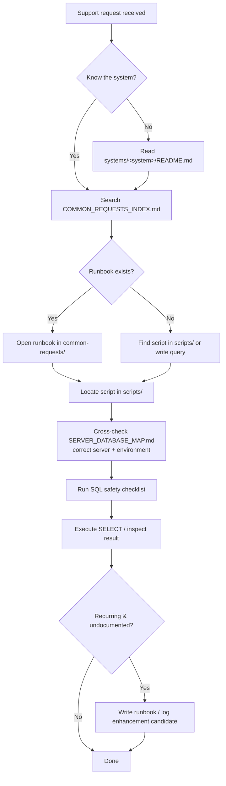

# VFC Operations Support

## What It Is

VFC Operations Support is a Git-based, version-controlled **knowledge base** — not an application. It centralizes the commonly used database support scripts, common-request runbooks, and operational references used across Vantage Financial Corporation (VFC) systems.

Instead of support SQL living scattered across individual developers' machines, chat history, and memory, this repository collects it in one place with consistent naming, safety standards, and a per-system layout, so that any team member (or a covering developer) can resolve a support request without having to call the original owner.

I initiated this repository as part of the development and support team to reduce single-person dependency and make on-call support repeatable.

## Why It Exists

- **Faster support resolution** — scripts and runbooks are centralized and searchable
- **Knowledge continuity** — a covering dev can pick up any system without calling the owner
- **Reduced key-person dependency** — support does not stall during leaves or transitions
- **Surface enhancement candidates** — recurring manual work is flagged as a signal that the system should do it instead

## Where It Lives

| What | Where |
|---|---|
| **Source repo** | [GitHub](https://github.com/vantage-vei/vfc-operations-support) |
| **Type** | Documentation / knowledge-base repository (no deployed application) |
| **Initiated** | 2026-04-10, by the IT System Developers Team |
| **Scope** | VFC systems only — not PEMI/VEI systems |

## Repository Structure

```
vfc-operations-support/
├── README.md                        ← Start here — objectives, structure, conventions
├── SYSTEM_INDEX.md                  ← All systems: owner, status, tech stack, README links
├── SERVER_DATABASE_MAP.md           ← Servers/databases mapped by environment
├── COMMON_REQUESTS_INDEX.md         ← Master list of all common requests across systems
├── ENHANCEMENT_CANDIDATES.md        ← Recurring requests flagged as feature candidates
├── CONTRIBUTING.md                  ← Rules to follow before your first commit
│
├── systems/                         ← One folder per company system
│   ├── ecore/
│   ├── esettlement/
│   ├── eterminal/
│   ├── ftr-generator/
│   ├── hr-online/
│   ├── navision/
│   ├── synapse/
│   ├── voyager/
│   └── voyager-fx/
│
├── shared/                          ← Reusable resources across all systems
│   ├── sql-snippets/                ← Generic reusable SQL patterns
│   ├── standards/                   ← naming-conventions, sql-safety-checklist, support-guidelines
│   └── references/                  ← glossary, abbreviations
│
└── templates/                       ← Copy these when adding new content
```

### Inside each system folder

Every system follows the same internal layout:

```
systems/<system-name>/
├── README.md            ← PIC, tech stack, environments, databases, dependencies, quirks
├── common-requests/     ← Index + one runbook per recurring support scenario
└── scripts/             ← select/ (read-only), update/, maintenance/, _archive/
```

## Conventions & Standards

| Convention | Rule |
|---|---|
| **Script naming** | `<database>-<action>-<description>.sql` — e.g. `bridgedb-get-sa-commission-rate.sql`. `<action>` is one of `get` / `check` / `search`; lowercase and hyphens only |
| **SELECT-only** | All scripts in the repo are read-only — no `INSERT` / `UPDATE` / `DELETE` |
| **PROD safety** | The [SQL safety checklist](https://github.com/vantage-vei/vfc-operations-support/blob/main/shared/standards/sql-safety-checklist.md) is mandatory before any live execution |
| **Retiring scripts** | Never delete — move to `_archive/` so history is preserved |
| **Branching** | Never commit to `main`; branch as `<prefix>/<system>-<description>` (`feature/`, `fix/`, `docs/`, `chore/`) and merge via PR |
| **Runbook rule** | If the same request is received more than twice and isn't documented — document it |

## What's Covered

The repository tracks nine VFC systems. Population is in progress — some systems already have a working script library, others are scaffolded and awaiting content.

| System | Business Owner | Script Library Status |
|---|---|---|
| eSettlement | TCSG | Populated (~20+ scripts) |
| eTerminal | Branch Operations | Populated (~24 scripts) |
| Voyager | TCSG | Started (a few scripts) |
| eCore | Branch Operations | README only — scripts pending |
| FTR Generator | TCSG | README only — scripts pending |
| HR Online | Human Resources | README only — scripts pending |
| Navision | Accounting | README only — scripts pending |
| Synapse | TCSG | README only — scripts pending |
| Voyager FX | Treasury, Accounting | README only — scripts pending |

> Scope note: this repository covers **VFC** systems. PEMI/VEI systems (e.g. ClientEase, the Philequity/Vantage websites, LOI Generator) are documented in this handover, not in this repo.

## How to Use It

When a support request comes in:

1. Open `COMMON_REQUESTS_INDEX.md` and search by system or keyword.
2. Follow the link to the runbook under `systems/<system>/common-requests/`.
3. The runbook names the exact script, database, and environment to use.
4. Locate the script under `systems/<system>/scripts/`.
5. Run through the SQL safety checklist before executing on a live environment.
6. If the request recurred and wasn't documented, write a runbook (or log an enhancement candidate).



## Relationship to This Handover

This repository and the handover documentation complement each other:

- **This handover** explains *what each system is* and *how it works*, across all three companies (PEMI, VEI, VFC).
- **VFC Operations Support** is the *operational toolbox* — the actual scripts and runbooks — scoped to VFC systems only.
- The handover's own [`common-requests/`](common-requests/index.md) section overlaps in spirit; where a request touches a VFC system, the executable SQL and step-by-step runbook belong in this repository.

## Current State & Known Gaps (Roadmap)

The repository is intentionally scaffolded ahead of being fully populated. For whoever inherits it, the outstanding items are:

- **Empty index files** — `COMMON_REQUESTS_INDEX.md`, `SERVER_DATABASE_MAP.md`, and `ENHANCEMENT_CANDIDATES.md` are stubs and need to be filled in.
- **Empty templates** — `templates/common-request-template.md` and `templates/enhancement-template.md` are empty; only `system-readme-template.md` is written.
- **Referenced but missing** — the README mentions `CHANGELOG.md` and `shared/sql-snippets/`, which do not exist yet.
- **No runbooks yet** — every `common-requests/` folder currently contains only `.gitkeep`; no scenarios have been written.
- **Stub systems** — eCore, FTR Generator, HR Online, Navision, Synapse, and Voyager FX have a README but no scripts.
- **Well-started systems** — eSettlement and eTerminal are the best examples to model new contributions on.

## Who to Ask / Maintenance

| Team / Department | What They Know |
|---|---|
| **Developer & Support Team** | Repository ownership, per-system script libraries, contribution workflow |
| **Per-system owners** | See `SYSTEM_INDEX.md` for the assigned owner of each system |

> Read `CONTRIBUTING.md` before pushing changes. No credentials, connection strings, or sensitive data belong in any file.

---

*Last updated: July 2026*
